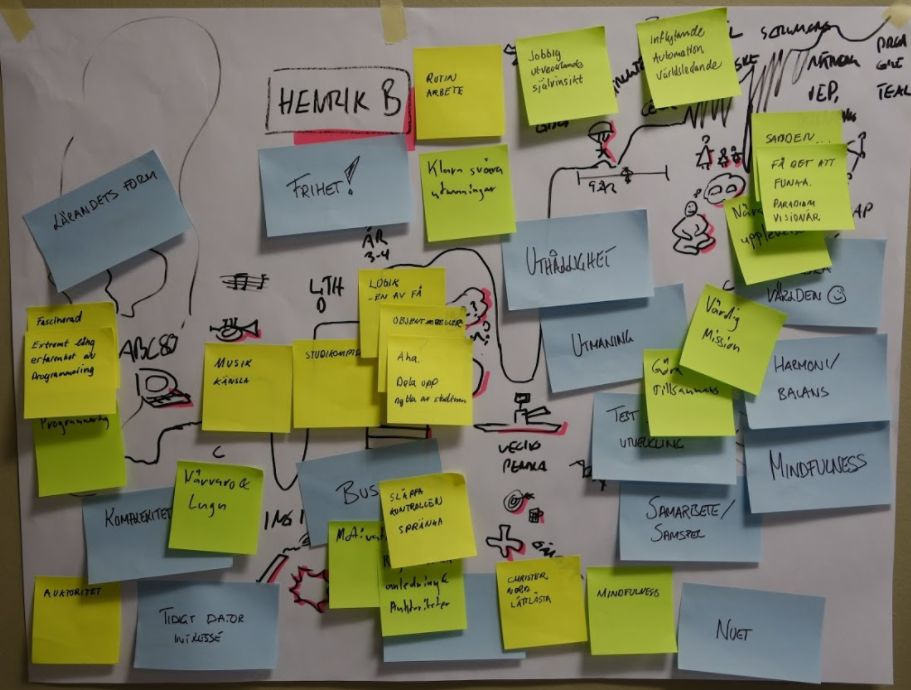

# Ground Rules & Decision Making

## Time required
Typically 5-15 minutes

## Materials Required

- Something big & visible to write decided ground rules on, like a flipchart paper

## Purpose

- This is a workshop facilitation technique to be used at the start of a workshop to help the participant focus on the task at hand and also to commit to work together in the best possible way 

- It also serves as a tutorial for the important "fist of five" decision making technique that all teams probably should master

## How

### Part 1: Intro

*One more thing before we get started on today’s topics. We will all be investing a whole day working on this, and we all have other things we could do instead. So it’s is very important that we make sure we get as much value of this day as possible. Agreed?*

*So, what I would like us to do now is to simple agree on a few ground rules for today on how we will work together to make this day the best possible. Let’s start with a quick pairwise discussion on what would be the most important ground rules for us to have a really productive and enjoyable day today? 3 minutes...*

Give them a few minutes.

*Ok, we will now try to make some decisions on rules that we can all agree to. Since there are quite a few people here it may not be so easy, but this is actually a really important skill to learn when working in an agile team. A team need to be able to take a lot of decisions, making sure there is buy in from everyone and it can not take huge amounts of time.*

*There is a really nice technique to deal with this that is called "fist of five", or “five finger voting”*

*When you do five finger voting we do not start with discussing a topic forever, instead we quickly move into voting on a concrete proposal instead. Each person can vote from 0-5 by holding up that number of fingers.*

With your fingers, show them the most important votes:

3: I can live with this or I accept it

4: Good idea!

5: Best idea ever I will really support this!

2: I have something I want to say before we make the decision
  - Ask if someone can propose a ground rule for today that will help make the day really valuable.When someone suggests something, facilitate decision making. 
  - If everyone votes 3 or more, it is decided. Celebrate how quick that was! With so many persons! Write it on the flipchart and repeat the procedure for some more proposals until someone votes less than 3
  - If one or more persons votes less than three, ask one of them if they can enhance the proposal so that it may get more support. Then facilitate a new round of voting around the new proposal. Repeat until something that the group can accept is reached. Kill any discussions and focus them no the proposal-vote-proposal...flow
  - If you want to get an interesting vote, ground rules for phones and laptops on tables can sometimes trigger some good and useful voting rounds
    -  If someone starts with suggesting no phones during the day, people will object until it usually ends up with that calls can be made on breaks, you can have the phone on silent and leave to answer family emergency calls etc
    -  Once all participants (about 40) had laptops open at the start of a workshop. After some voting the rule accepted was: "If you close email, slack, turn off internet etc" then the others would trust you to "Only take notes" ;-) Nobody used their laptops during the day… ;-)

After a while just quit the exercise, make some points:
- It is important to limit unproductive speaking and unstructured discussions if we are to be making quick decisions as a team. It takes to much time if everyone wants to speak and just repeat the point and explain why they agree. Really tough facilitation is needed, e.g using "fist of five"

- The technique quickly brings up any differences and lets us focus on resolving them.

- By this technique you get "consent". This means people accept the group decision. This is not the same as unanimous decisions. People may have other ideas, but after being heard it is usually possible to get consent anyway. The power of this is increased buy in.

- Buy in is not equally important for all decisions. For way of working issues it is though. All need to consent for any way of working decision to be effective

- For other types of decision you can use other methods e.g. majority voting. But you need to decide on decision method before you start.

# Journey Lines - Facilitation Guide

## Purpose

*   Let a team get started on their path toward more self management
*   Let a team learn more about each others when it comes to
    * working history
    * skills
    * what each person enjoys doing and not
*   Deepen the level of communication by having other team members confirm that they have seen each other and appreciates each others skills and experiences 
*   Usually this brings in also some conversations on a more personal nature. This enhances the basic emotional safety on the team. "It is ok to be human rather than being a professional robot at work". (This aspect was found by Google to be the most important predictor of team success)

## Source

This exercise is very well described in Lyssa Adkins' book "Coaching Agile Teams". She attributes it to Tichy N 2002, "The Cycle of Leadership: How Great Leaders Teach Their Companies to Win"

## Time required

*   5 minutes intro
*   10 minutes for each person to prepare
*   After that about 1 hour per 5 persons in the team

## Preparations
*   Get materials
      *   Flip chart paper
      *   Whiteboard markers to draw "Journeylines"
      *   Postits
      *   Markers for posits
      *   A timer to keep track of time boxes for presentations

## Intro

**Example**

*In most agile setups these days we have this concept with self managed teams. How many have heard about that? (Hands up)*

*One this that self management means is that that the team, not a project manager or team leader, decides how to work together, who does what etc.*

*To be able to do this is good for us to know a bit more about each others experience and what each of us we enjoy working on and not, so that is the purpose of this next exercise.*

*This is how it will work:*

*   *Step one is 10 minutes. In those ten minutes I would like you all to take one of these flipchart papers and create a short presentation of jour journeys through your working lifes*. &lt;Show them your pre-created example&gt;. When the line goes up it means you enjoyed it, when it goes down, not so much. Feel free to include more personal events also if you want, because life on work off work usually has an impact on eachother*
*   *Then we will start working through the presentations person by person.*
     *   *For each person we will first get a presentation of the line. While listening, the rest of the team makes notes about what you find interesting, defining or useful the person presenting.*
    *After that each team member goes to the poster one by one and presents their observations as they put them on the poster.* &lt;Show them what you mean by doing it as you explain&gt;

*Ok, lets take 10 minutes to prepare some posters.*

When they are done, move on to next section...

## Facilitating the flow

If you want to, think about if there is one person in the team that you think may be more comfortable being open with problems/issues/feelings with the team and ask that person to go first. If someone sets a personal tone first it make the exercise even better. You could also do this yourself if you want. 

If you think it will be needed, keep a timer running to manage some time boxes. Especially some people can go on for quite a while when presenting.

In your own comments, focus on seeing the whole person rather than commenting only on the professional skills-related part.

You can also comment from the point of the agile coach/Scrum Master, i.e. if the person enjoys working in teams, close to customer, fast feedback, fast decisions etc comment that this is a match with what the team will be asked to do.
