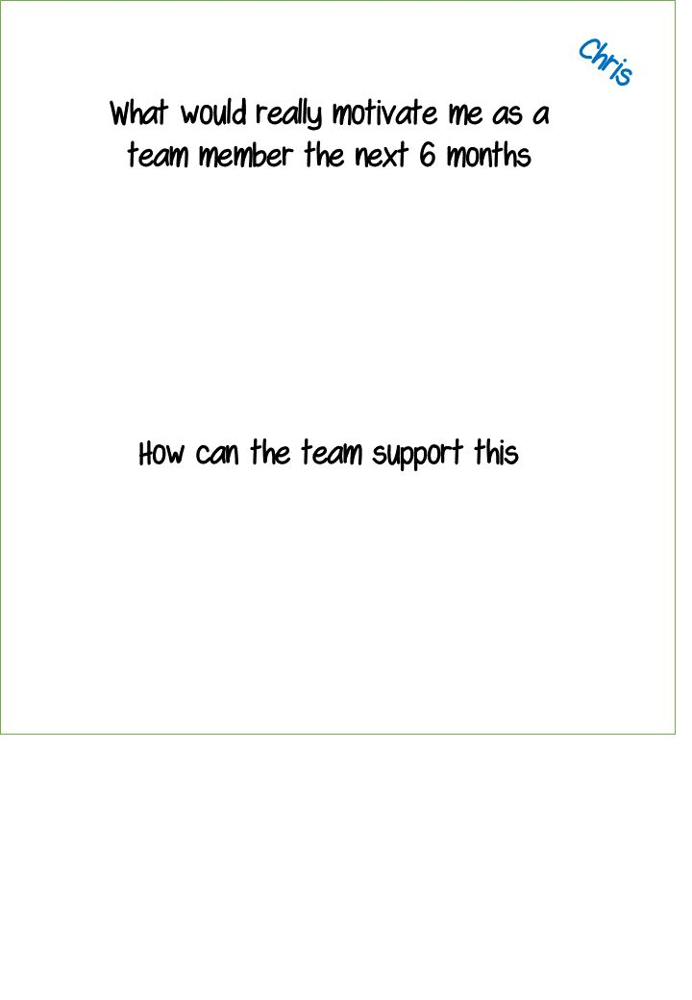

# 08 - Individual Goals

## Time required

Typically 1,5 hours

## Materials Required

>   Assorted positits

>   Markers

>   Flipchart papers

## Purpose

>   This is a teamstart/team development exercise. 

>   Decentralization, self organization and agile development relies heavily on highly motivated individuals. This exercise is designed to help the team work in a way that is supporting individuals' motivators.

>   It also helps the team to distribute work better since each person's preferences gets known to the team

>   For a team we usually cover goals from several perspectives:

>   > Organization

>   > Product

>   > Team

>   > **Individual &lt;- Covered in this guide**

## How

### Part 1: Intro

*- Why are you here, in this team?*

*Have you thought about this question? -) Maybe some of you are here because your boss told you to ;-) ...but it is actually much better if we can work together to create some really good conditions so that everyone is here just because they really want to!*

*So, in this session we will will work a bit on your individual goals both so that you can find some and so that the team can help you fulfil them!'*

*- Show the question written on top of a sample flip chart, like the one on the first page.*

### Part 2: Pairwise coaching

*So, we will do this exercise in three steps, for the first two will will work in pairs, so*

*   *First could you all pair up with someone… Wait until they have...*
*   *Now get one flipchart each and fill it out like my example*

*Wait...*

*   *The next 15 minutes, one person per pair will fill in the top of his/her poster. It can actually be hard to find some good answers to this question by yourself, so that's why we will be working in pairs. One person will fill out the top of the poster and the other will be the "coach"!*
    
*   *The responsibility of the coach is not to make suggestions, but to ask questions to help the other person explore their own thoughts and organize them.*

Last page contains some suggestions on questions a coach can ask. Print them out so that all coaches can have one. Let them have some time to study it before you start.

Then let them go for 15 minutes and then ask them to switch

### Part 3: Team support of individual motivators

*Next*

>    > Let each person describe their poster, to the team

>   > As they speak, let the team take notes on how that can support the person in reaching what they need/want

>   > Collect team suggestions at the bottom of each flipchart flipchart

>   > Facilitate the discussion so that actions are clear and next step for each support action is set

>   > Facilitate decision making, state the suggestions and let the team consent using "fist of five" voting for example

## Coaching question examples

>   What was a time when you really enjoyed work?

>   What about that did you enjoy?

>   What else...?

>   What are some of the things you enjoy at work?

>   How did that feel when you...&lt;achieved something&gt;?

>   What was another time when you had that feeling?

>   Can you remember a time when you felt really satisfied/excited/happy?

>   Say something more about that...?

>   What makes you feel alive?

>   What motivates you?

>   What are your interests?

>   What about the work we are doing makes you excited?

>   What would you like to learn?

>   What else would make you really happy about having been in this team?

>   What else would you like to experience on this team?

>   I hear that you really enjoy &lt;...&gt;...

>   &lt;....&gt; Seems important to you...

# Balancing Team- and Individual work

## Purpose

*   Create a shared view in team when it comes to advantages, disadvantages and personal preferences when it comes to working closely as a team and when working individually

*   Create some tools that will enable the team to get the benefits of and avoid the drawbacks of both ways of working 

*   Enable and inspire each team member to take responsibility for wellbeing of all other team members

## Time required

35-50 minutes

## Materials Required

*   8 flip chart papers, board markers
*   Tape
*   Post-Its and some other small notes/papers

## Preparations

*   Make sure a basic level of psychological safety exist in team before doing this
*   Tape a big cross on the floor
*   Put small notes/Post-Its at the ends of the tape: team/individual, (positive)/-(negative)
*   Prepare your agenda so that the spirit in the room is good when we start. You may want to do an energizer? This fits nicely as a follow-up to "Journey Lines" or "Me Map"

## How

Explain that:

*   The goal of the exercise is to explore and to get to know our various experiences and thoughts around working individually and working as a team.
*   There is no right and wrong, just different experiences and thoughts
*   The goal is not to get everyone to think that 100% close team collaboration is the one and only true solution

**Intro/Warm up**

Explain the two axles: positive, negative, working as a team, working individually

Invite the participants to wander around on the grid and try to recall some of their own experiences from the various quadrants. Give them 2 minutes in silence to do this. The purpose is to start recalling memories and to focus. When you give them these instructions - walk around in the grid (show by example is more effective than explaining)

**Exploration Pros and Cons**

In this section we will explore pro's and con's of first individual work and then teamwork. We will start with positive - individual. People that appreciate individual work may feel more uncomfortable in an agile
context. By doing it first we show acknowledge the validity and importance of everyone's views/experiences.

*   On a flip chart stand: Write "Positive - Individual" as header
*   Get everyone to stand in the + - individual quadrant
*   As one of the team members to take notes on the flip chart as all team members share their experiences of the positive aspects of working individually
*   When done, save the flipchart paper somewhere visible. On the wall/floor or whatever works in the room you use.

Repeat this process in this order (new flip chart paper for each :

*   Negative - Individual work
*   Positive Teamwork
*   Negative Individual work

**Reflection, what way off working is best?**

Facilitate a quick reflection/discussion:

*   Is teamwork always the best approach for all types of work?

The conclusion could be along the lines of "We need to be smart and pick a way of working that will maximize the positive sides of both way of working."

Ask the team if they agree with this statement.

**Warning signals and actions**

"Let's think about how to achieve this in practice!" - On a new flipchart write "Individual work - warning signs". Ask the team - "How can we see if we are on our way into the negative aspects of individual
work?"

Let a team member make notes as the team shares their ideas on this.

When some warning signals have been collected, switch to collecting actions.

“What actions would we take when we notice these signs - to get back into one of the positive quadrants"

Again, let a team member do the note taking as team members make suggestions.

Repeat for teamwork

**Reflection, who is responsible?**

Ask the question

*   Who is responsible for us being in the positive?

Ideally this would be the responsibility of all team members.

**Current preferences**

"We are all humans and we may have our preferences for how we want to work. This may change from week to week, day to day etc, depending on how many things such as life in general."

"Let’s end with exploring where you feel the most at home right now on the grid. If you have a preference: stand on the team individual axis to show what it is" ( Do it yourself when explaining)

**Conclusions**

Ok, thank you all for sharing your experiences and creating all these nice posters!

Facilitate a wrap-up for the team. The purpose is to get buy in for any next steps and to celebrate and reinforce any insights or learnings. 

Ending on a positive note is also good!

Here are some possible questions you could ask them to discuss e.g. in pairs (pick one or two)

*   What was most interesting or valuable for you about this ws?
*   What do you think our team can gain from looking for these warning signs/taking action?
*   What is needed for us to follow through on this and not having it fade away?
*   What else do we need to do to get the benefits we have been talking about?
*   How do you think paying attention to this can increase the well-being in our team?
