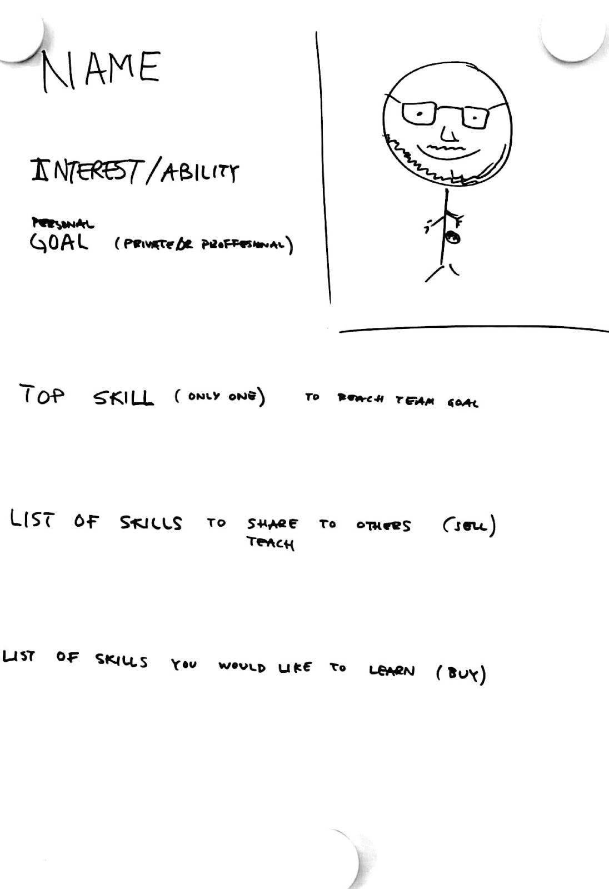

# Market of skills

## Purpose

-  Make skills the team have visible to entire team.
-  Increase the sharing of skills among team members

## Possible learning points

-  By making our skills visible to others we can learn from each other better.

## Duration

-  30-60 min

## Material

-  One A3 paper for every participant.
-  Pens in different colors (not necessary but definitely a bonus) and sharpies.

## How

-  Invite each person to create their own poster. Show a template of how the poster can look like. It shall contain this: (10-15 min)
   -  Name
   -  Self portrait
   -  Interest or ability (that are unknown to others, could be related to professional or private life)
   -  Personal goal (could be private or professional)
   -  My top skill that will help us to reach our goal
   -  Skills that I can share with others (sell)
   -  Skills I would like to learn (buy)
-  Invite each person to present their poster. (1-3 min/person)
-  Invite the group of people to self-organize to agree on one buy and one sell transaction per person. What to buy, what to sell and how to take the next steps together. (10 min)

