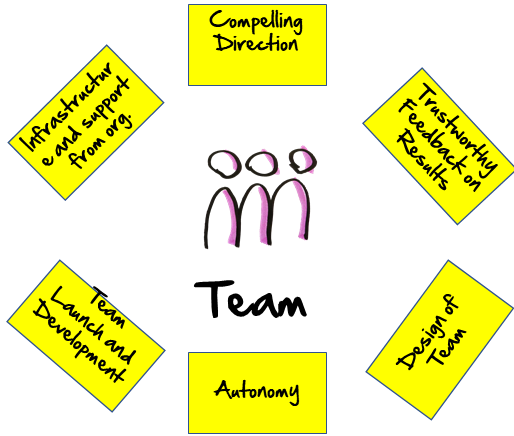
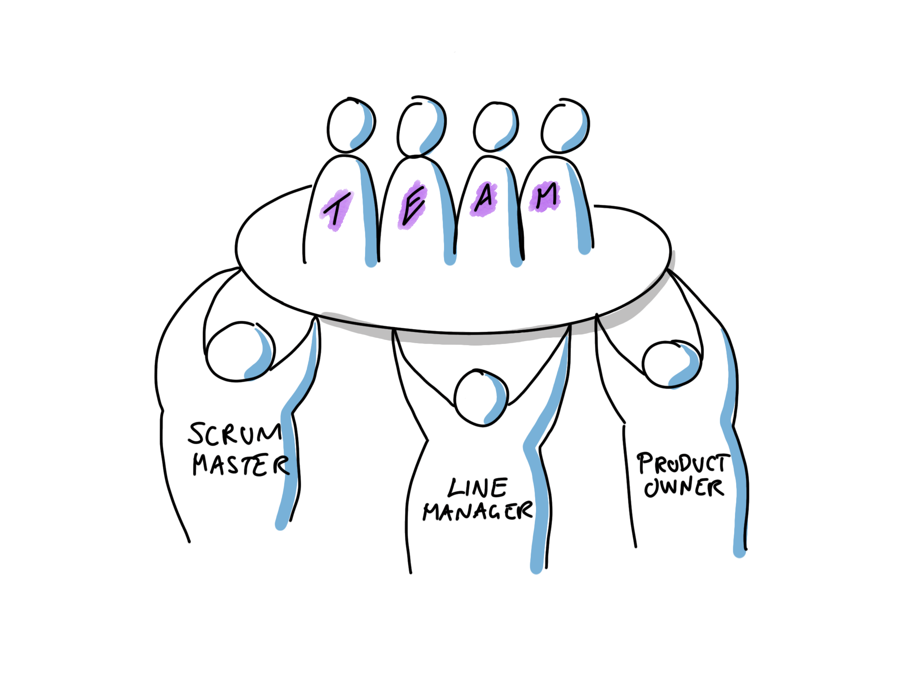
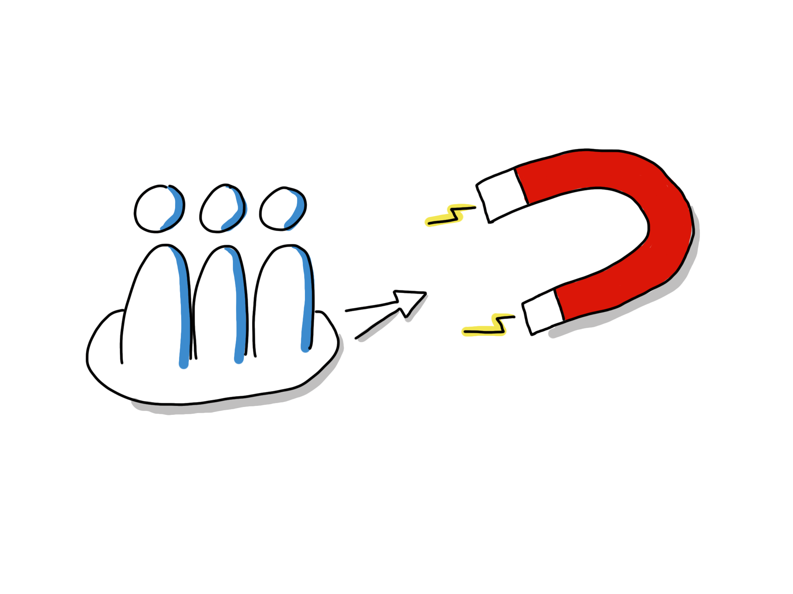
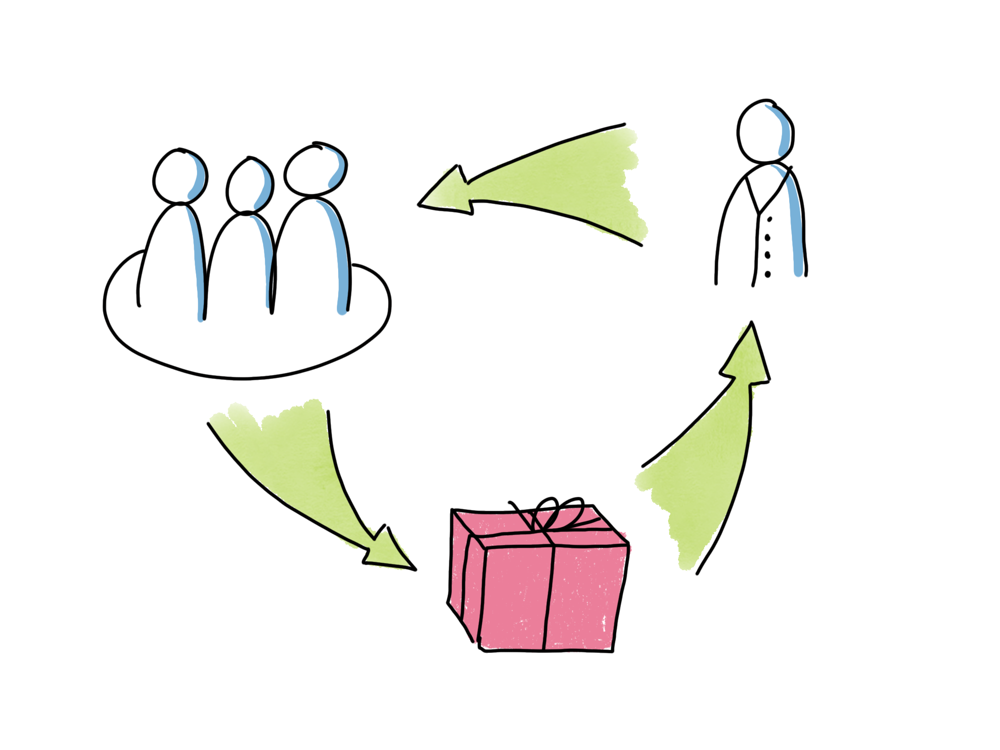
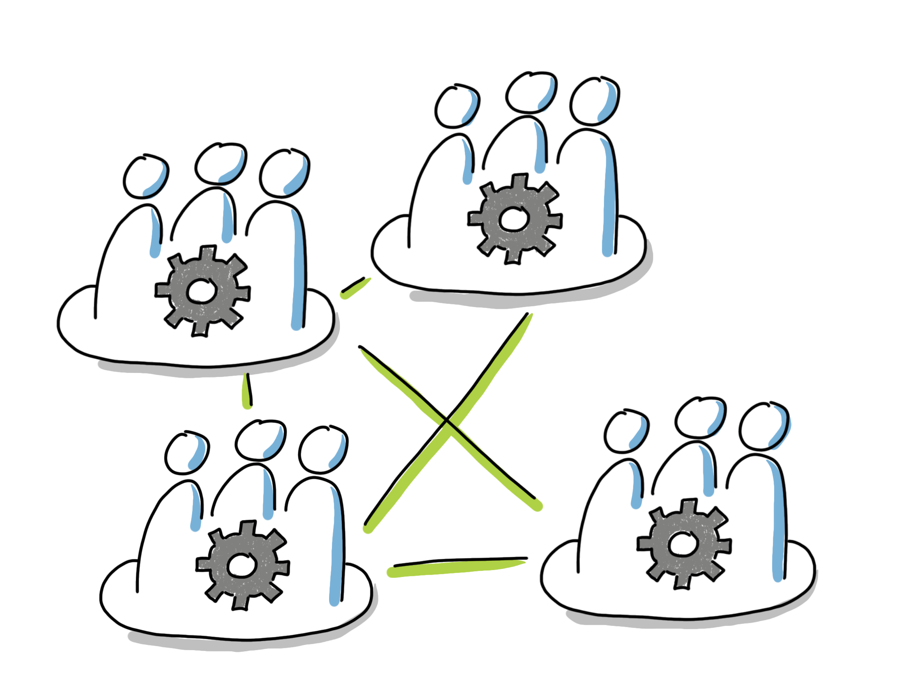
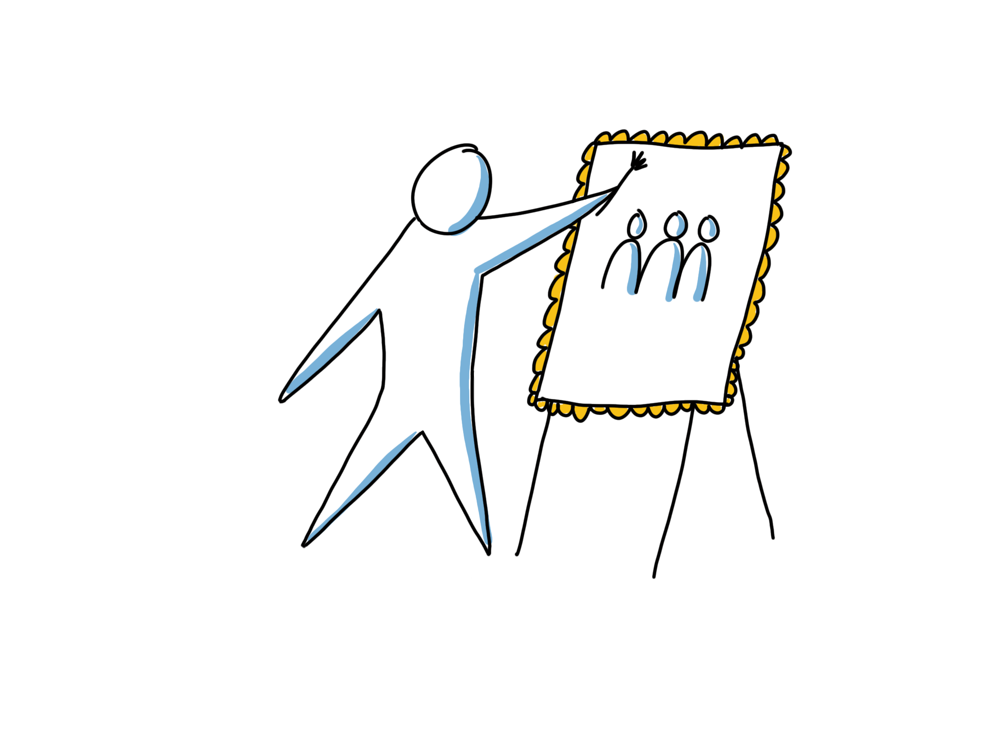
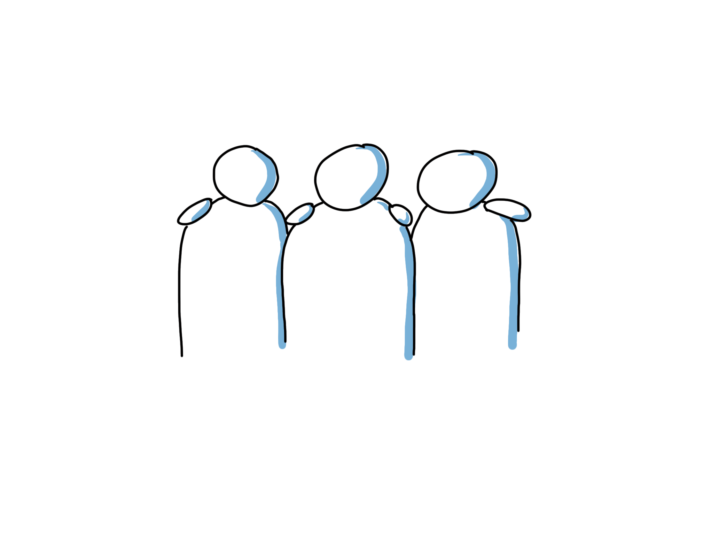
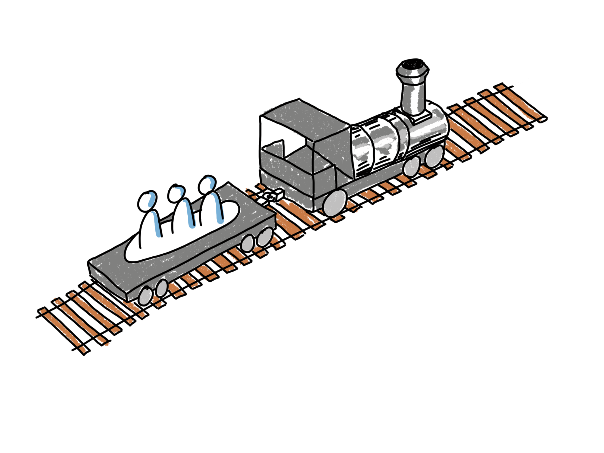

# Ett ramverk för teamutveckling

## Varför team ofta inte fungerar i praktiken

Ett väl fungerande team kan skapa magi, men här är några oroväckande fakta från teamwork i den verkliga världen:

* Forskning som jämför prestationen hos team med vad som produceras av ett motsvarande antal individer som arbetar själva finner nästan alltid att individerna överträffar teamen [1].
* I praktiken har fem av nio insatser/försök att förbättra teamets prestation ingen positiv effekt alls! [2]
* Det finns stor enighet i forskarsamhället om vad som fungerar och inte när det gäller att hjälpa team att nå hög prestanda. 

Så, i teorin vet vi hur man får saker att fungera. I praktiken tillämpar organisationer inte denna kunskap när de startar och utvecklar team. Därmed misslyckas de att få fulla nyttan av att organisera sig i team. 

För att hjälpa till i denna situation beslutade vi oss att sätta samman denna enkla guide. Den innehåller ett ramverk och några praktiska övningar som du kan använda för att starta och stödja de agila teamen i din organisation. Vi skapade den för att stödja Scrum Masters, linjechefer, agila coacher och andra som vill skapa fantastiska team.

För att undvika att falla i fällan med fem av nio tekniker som låter bra men faktiskt inte hjälper alls, har vi baserat allt i guiden på principer som är väl grundade i forskning. 

Detta är dock inte bara ett teoretiskt ramverk. Vi har använt det på ProAgile i mer än tio år för att hjälpa agila team att komma igång och fortsätta förbättras. För oss har det hjälpt till att skapa goda resultat i praktiken. Vi hoppas att du också kommer att ha nytta av tankarna och övningarna.

## Vad är ett framgångsrikt team?

Innan vi går in på att beskriva hur man skapar ett framgångsrikt team, låt oss enas om vad vi menar med "ett framgångsrikt team". Nedan kan du se en föreslagen definition från forskaren Richard Hackman. Ett framgångsrikt team:

* formar aktivt intressenternas förväntningar och sedan överträffar dem
* växer som team, blir mer och mer kapabla att ta sig an större utmaningar tillsammans
* växer som individer och ökar sina individuella färdigheter, både mjuka och hårda

Den relativa vikten av dessa punkter varierar beroende på teamets syfte. För ett team som kommer att arbeta tillsammans mycket över en lång tid är alla punkter viktiga. Om du är intresserad av ett team som det, kanske denna text är till nytta för dig!

## Ramverket

Ovan kan du se en visualisering av ett ramverk som har visat sig användbart för oss när vi tänker på hur vi bäst kan hjälpa ett team på deras resa. 

De sex områdena som visas med de gula post-it-lapparna ovan är ett något annorlunda sätt att se på de fem villkoren som den välkända teamforskaren Richard Hackman använder för att diskutera teamets prestanda i sitt arbete [3]. 

Hackman påstår att utvärdering av ett teams miljö och uppställning, med användning av dessa områden, kan förklara 90% av variationen du ser i teamets prestanda! Detta är ju väldigt positivt eftersom det ju betyder att genom att fokusera på dessa områden, genom att förbättra arbetsförhållandena för dina team steg för steg, kan du ha en enorm inverkan på prestationen hos de team du bryr dig om!

### Hur man använder ramverket

Här är ett förslag på hur man kan använda ramverket:

* Identifiera de ledare som mest nära bryr sig om/kan påverka prestandaförhållandena för ett team. 
I ett klassiskt agilt sammanhang kan detta vara Produktägaren, Scrum Master och linjechefen för teamet.
* Planera regelbundna träffar för dessa ledare.
* Använd ramverket vid dessa sammankomster för att systematiskt undersöka arbetsförhållandena för ditt team. Vad finns redan på plats? Vilket skulle vara ett nästa steg för att möjliggöra ännu större teamprestanda inom varje område?
* Välj minst ett område där du vill göra en förbättring, planera och genomför ett experiment för att göra förbättringen. Övningarna senare i detta papper kan vara användbara för att göra några av dessa förbättringar. 
* Upprepa.

I nästa avsnitt kommer vi att undersöka var och en av villkoren/områdena ett för ett. Detta är för dig att använda som referens när du utvärderar förhållandena för varje team och tänker på nästa steg som beskrivits ovan.

# De sex nyckelområdena

## Engagerande riktning

Detta är den viktigaste av de olika faktorerna du bör överväga när du tänker på vilka förhållanden du kan hjälpa till att skapa för dina team. 
Det är en av fem faktorer som identifierats av Hackman som möjliggör teamets prestanda. 
Wheelan fann att detta var en av tre faktorer som verkligen spelade roll vid undersökning av effektiva teaminterventioner. 
I Googles Aristotele-forskning [4] fann man att tre av fem nyckelvillkor som påverkar prestanda var målrelaterade.

Således behöver ett team någonst at tsikta på, en riktning som de känner sig inspirerade att resa tillsammans i! 

Ett team kan ha många olika typer av mål som tjänar till att sätta denna övertygande riktning. De kan vara: 

* Produktutvecklingsrelaterade
* Organisationsutvecklingsrelaterade
* Teamrelaterade
* Individrelaterade

Att skapa och bearbeta dessa mål är ett av de allra första stegen för att hjälpa ett team att nå hög prestanda. I den andra delen av denna skrift finns många övningar för att hjälpa dig göra detta på ett bra sätt.

Det vi letar efter är en riktning som:

* kräver att hela teamet arbetar tillsammans. Om teamet inte behöver arbeta tillsammans för att nå målen, finns det inget behov av ett team. Om du ger mål till team som individer kan nå individuellt, bör du inte förvänta dig att teamwork ska uppstå.
* uppfattas av teamet som ganska utmanande, men möjligt.
* kommer att driva den inre motivationen hos de enskilda teammedlemmarna.

### Några tekniker som är användbara i detta sammanhang

* Impact mapping
* Value Proposition Canvas
* Business Model Canvas
* Sprintmål
* Hjälpa teamet att vara nära och empati med de människor som kommer att dra nytta av lösningen/tjänsten de levererar. I ett Scrum-sammanhang kan detta uppnås genom att uppmuntra nära samarbete mellan team och intressent och undvika beteenden som mellanhänder från roller som Produktägare.

### Relaterade övningar från del 2

* [*Individuella Mål*](https://proagileab.github.io/agile-team-development/guides-SV/Individual-Goals.html)
* [*Organisatoriska Mål för Team*](https://proagileab.github.io/agile-team-development/guides-SV/Organizational-Goals-for-Teams.html)
* [*Produktmål för Team*](https://proagileab.github.io/agile-team-development/guides-SV/Product-Goals-for-Teams.html)
* [*Team Vision*](https://proagileab.github.io/agile-team-development/guides-SV/Team-Vision.html)

## Tidig och pålitlig återkoppling

Detta är också en av de tre viktigaste aspekterna att överväga när du försöker skapa förutsättningarna för teamets prestanda. 

Jag arbetade en gång med ett team som verkade ha det ganska bra på jobbet, men när det kom till själva arbetet kände jag att deras hjärtan inte riktigt var med. Vid slutet av sprintar skickade de iväg vad de hade utan att oroa sig så mycket om det de skickade var av tillräcklig kvalitet, om det verkligen fungerade eller om det var av värde.
 
Nu var detta team en del av en större organisation och hade inte all utrustning de behövde för att testa om det de hade skapat faktiskt fungerade eller inte. Vid slutet av sprintar skickade de helt enkelt saker till ett annat team som skulle testa det. Så jag frågade dem, "hur lång tid tar det innan ni får feedback från testteamet?". Svaret jag fick var att "Det kan ta upp till 18 månader!"
 
Det är uppenbart att vänta så länge på feedback på vad du gör inte är den mest inspirerande arbetsmiljön. I grund och botten får du känslan av att ingen bryr sig om vad du gör och att det ändå inte spelar någon roll. Det som såg ut som oengagerade, något ansvarslösa, individer var bara ett logiskt resultat av att skapa en miljö som skapade det beteendet!
 
### Några tekniker för att skapa snabb återkoppling

* Skapa verkliga potentiellt releasbara inkrement av din produkt/tjänst så frekvent som möjligt. Åtminstone varje sprint.
* Dela upp berättelser vertikalt så att även varje releasbart inkrement skapas i många mindre steg, var och en ger teknisk feedback om fungerande integrationer etc.
* Se till att teamen har tät kontakt med intressenter, kunder och slutanvändare. I Scrum kan detta vara under Sprintar och vid Sprint Reviews.
* Tekniker som impact mapping från avsnittet om övertygande riktning som ser till att teamet faktiskt vet vad syftet med arbetet är. Utan det är varje mått på framsteg mindre meningsfullt.

## Tydligt och betydande mandat

Här är ett mönster jag ständigt stöter på när jag arbetar med aspirerande agila organisationer:
 
Efter lite inledande agil utbildning antar teamen att de nu är självstyrande och sätter glatt iväg för att bestämma olika saker. Strax efter skjuts deras initiativ ner av chefer som fortfarande har uppfattningen att allt som bestämts fortfarande är deras ansvar, inte teamets. Teamen inser då att allt detta prat om agil och empowerment var inte dsant. De förstår att ingenting har förändrats och återgår snabbt till sin tidigare nivå av oengagerad efterlevnad. Organisationen misslyckas med att bli mer agil eftersom agilitet verkligen beror på engagemang och initiativ från varje individ.

Så, vad vi behöver är att teamen vet vad de kan bestämma och vad inte. Don Reinertsen uttryckte det väl när han sa att människor inte ska gå in i osynliga elektriska stängsel.

Observera att det måste vara en betydande mängd saker som teamen får besluta om. Människor i allmänhet tycker om att ha inflytande över hur det arbete som de utför ska utföras. Dessutom har de som gör arbetet förmodligen några färdigheter och kunskaper om arbetet, så även ur den synpunkten verkar det rimligt att de kan bestämma hur saker ska göras.
 
Jag tycker att det är användbart att definiera nyckelbeslutsområden som föreslagits av Don Reinertsen och använda delegation nivåmetoden från Jürgen Appello.
 
### Några tekniker för att förtydliga och dela ut mandat

* Delegeringspoker och delegeringsbräda.
* Agile ledarutbildning för involverade chefer. Speciellt fokus på behovet av decentralisering och hur man steg för steg återställer motivationen och initiativet som förstördes av den klassiska hierarkiska ledningsmodellen.

### Relaterade övningar från del 2
* [*Klarifiera Teammandat*](https://proagileab.github.io/agile-team-development/guides-SV/Clarifying-Team-Mandate.html)

## Teamdesign

Detta är också en av de viktigaste aspekterna att överväga när man försöker skapa förutsättningarna för teamets prestanda. 

### Beteendestilar

Kanske är en av de mest populära övertygelserna om team att överväga personligheter eller beteendestilar hos teammedlemmar är användbart när man utformar och utvecklar team. Det verkar inte finnas några bevis för denna övertygelse.
Google i sin Aristoteles-studie undersökte detta och fann att blandningen av personligheter inte hade någon inverkan på teamets prestanda.
Richard Hackman avfärdar också denna övertygelse. Hans arbete betonar att med rätt förhållanden kommer ett team att kunna arbeta sig igenom svårigheter orsakade av individuella skillnader.
För att inte tala om att de flesta vanliga verktyg för att arbeta med personlighetsstilar faktiskt inte har större validitet än horoskop. Men ingen anledning att gå in på det eftersom ramverket som täcks här faktiskt har vetenskapligt stöd och det bygger inte på några verktyg för att klassificera personligheter.

Vad spelar då roll när du utformar ett team? Låt oss titta på vad forskningen säger i följande avsnitt!

### Teamstorlek och tydliga gränser

Låt säga att du har något riktigt intressant men mycket utmanande arbete framför dig. Du har skapat en plan som ett team, och du märker att när du är på väg att komma igång känner du dig energisk och att du faktiskt såg fram emot det. En vecka in i projektet saknas plötsligt en av dina teamkamrater och du får reda på att han tar en månad ledigt på Bahamas och det verkar som att chanserna att uppnå dina mål nu är nära noll. De flesta människor kommer att ha mycket svårt att fortsätta bidra med sin fulla potential i en situation som den. Varför skulle du ge ditt bästa när de människor som är gemensamt ansvariga tydligt inte gör det?

Som påpekats av Christopher Avery [5]: Motivationen hos ett helt team ställs vanligtvis av den minst engagerade/motiverade teammedlemmen. Den minst inspirerade personen tenderar att dra ner alla andra till samma låga engagemangsnivå. Hackman nämner också det relaterade fenomenet "Social Loafing", någon som "åker snålskjuts" och inte bidrar med sin del av arbetet. 
 
En vanlig orsak till detta problem är vanan i många organisationer att tilldela människor deltid till flera team, eller att ställa saker så att team är beroende av externa experter utan engagemang för teamet. 

Sättet att förhindra detta är att sätta tydliga gränser för teamet. Ett team behöver veta vem som är i teamet och vem som inte är det. Vem kan jag räkna med när det blir tufft och vem kan ha andra prioriteringar?
 
I grund och botten, för att få detta att fungera i en mjukvaruutvecklingskontext, behöver vi team med heltidsmedlemmar. För att göra detta lättare att uppnå, kanske du vill överväga att behålla team intakta och låta befintliga team ta sig an vilka projekt/arbeten som helst som dyker upp istället för att starta upp ett nytt team för varje nytt företag. 

För att undvika "Social Loafing" försök också att göra teamet så litet som möjligt. Om ett team knappt har tillräckligt med människor för att klara av att slutföra sin uppgift minskar sannolikheten för att någon "åker snålskjuts". Koordination är också mycket enklare än i ett stort team. Om en handfull personer kan få jobbet gjort är det en bra storlek att sikta på.

### Ömsesidigt beroende
 
Överraskande för vissa är kanske att det ideala i ett agilt team är inte att alla kan utföra varje typ av uppgift uppgift. Ur ett teamarbetsperspektiv är det faktiskt bättre om teammedlemmar har olika färdigheter, så att de faktiskt måste arbeta tillsammans för att uppnå team-målen.
 
Detta stämmer också bra överens med idén om "T-formade" människor. Vi vill ha människor som har djup expertis inom något område. Detta är vad som möjliggör att vi kan skapa produkter med stor prestanda. Att bara förlita sig på experter tenderar att ta för lång tid. Det kommer att bli mycket väntetid när de skickar arbetet mellan varandra, och möjligheten kan vara borta när vi äntligen lyckas få ut produkten. Om människor istället är experter, men också är villiga att hjälpa till med saker som de inte behärskar så bra då och då, kan vi också uppnå snabbhet i utvecklingen. 
 
Sättet att få detta att fungera är att tilldela tillräckligt stora saker till team så att en mängd olika färdigheter behövs för att utföra arbetet. Idealiskt sett bör team inte bara "implementera krav". De borde ha den större uppgiften att kreativt sträva efter att lösa några kundproblem, eller att optimera värde för kunder inom något område.
S
tabilitet över tid
Teamutvecklingsmodeller inkluderar vanligtvis någon form av faser, som "Forming, Storming, Norming och Performing" av Bruce Tuckman, eller faserna 1-4 som definierats av Susan Wheelan. De indikerar att det tar lite tid att få ett nytt team igång. I början kommer teamet att kämpa med att alla hittar sina roller och sätt att arbeta tillsammans. När du sorterar ut det kommer teamet så småningom att kunna leverera mer värde än vad teammedlemmarna skulle ha kunnat göra om de hade arbetat som individer. Detta kan lätt ta 6 månader eller till och med ett år.
 
Så, du kanske vill överväga att hålla teamen tillsammans under längre tid. För att göra detta möjligt, tänk på att tilldela projekt/arbeten till befintliga team snarare än att bilda ett nytt team för varje nytt företag.

### Några tekniker för att jobba med ömsesidigt beroende

* Team självval
* Övergå från projektteam till stabila team med heltidsmedlemmar
* Tilldela större, värde-/effektbaserade, mål till team, se kapitel om övertygande riktningar

## Aktiviteter för teamutveckling

Kanske är de vanligaste aktiviteterna för teamutveckling att gå på bowling och sedan fortsätta med middag och drycker. Eller kanske lösa ett pussel som ett "Escape room", försöka skapa teamwork genom att göra något helt annorlunda än vanligt arbete. Detta kan vara kul, men dessa aktiviteter faller förmodligen in i kategorin 5/9 aktiviteter som inte ger någon mätbar förbättring i teamwork enligt Susan Wheelan. Så fortsätt gärna erbjuda roliga saker till anställda, men räkna inte med allt för stora effekter i form av ökad teamprestanda. 

### Vad fungerar då?

Tja, några av aktiviteterna från tidigare avsnitt, såsom att bearbeta och enas om riktning/mål på produkt-, organisation-, team- och individnivå är stora teambyggnadsaktiviteter. Teamet kan inte självstyra om de inte känner att riktningen är motiverande. Dessutom kommer teammedlemmar endast att bidra med sin fulla potential när de känner att riktningen är övertygande.

Ett agilt team behöver också lära sig nya färdigheter för att vara självstyrande/självorganiserande. Särskilt behöver de lära sig hur man:

* Snabbt fattar tillräckligt bra beslut som team
* Löser problem som team
* Navigerar konflikter som team

Att ha några av dessa färdigheter är till hjälp eftersom teamen också behöver besluta

* Grundregler för att arbeta tillsammans
* Specifika arbetssätt som alla teammedlemmar åtminstone håller med om. (Konsensbeslut är tillräckligt här, inte konsensus)

I Googles Aristotele-teamforskning fann man att "Emotionell Säkerhet" (aka förtroende) var den bästa prediktorn för teamets prestanda. Emotionell säkerhet betyder i grund och botten att du kan visa upp dig som din fulla själv på jobbet. Du kan vara dig själv och behöver inte sätta på en mask eller skyddande rustning eftersom du vet att ingen kommer att försöka skada dig.
Detta är förmodligen faktorer som de flesta teambyggnadsaktiviteter försöker ta itu med genom olika sociala aktiviteter utanför arbetet. Kanske hjälper det till och med lite, men genom att använda jobbfokuserade specifika aktiviteter, några listade nedan, kan detta tas till en helt annan nivå.

### Relaterade övningar från del 2

* [*Individuella mål*](https://proagileab.github.io/agile-team-development/guides-SV/Individual-Goals.html)
* [*Organisatoriska mål för team*](https://proagileab.github.io/agile-team-development/guides-SV/Organizational-Goals-for-Teams.html)
* [*Produktmål för team*](https://proagileab.github.io/agile-team-development/guides-SV/Product-Goals-for-Teams.html)
* [*Team vision*](https://proagileab.github.io/agile-team-development/guides-SV/Team-Vision.html)

* [*Grundregler och beslutsfattande*](https://proagileab.github.io/agile-team-development/guides-SV/Ground-Rules-and-Decision-Making.html)
* [*Journey lines*](https://proagileab.github.io/agile-team-development/guides-SV/Journey-Lines.html)
* [*Roller och förväntningar*](https://proagileab.github.io/agile-team-development/guides-SV/Roles-and-Expectations.html)
* [*Uppskattningkort*](https://proagileab.github.io/agile-team-development/guides-SV/Appreciation-Cards.html)
* [*Balansera team- och individuellt arbete*](https://proagileab.github.io/agile-team-development/guides-SV/Balancing-Team-and-Individual-Work.html)
* [*Marknad för färdigheter*](https://proagileab.github.io/agile-team-development/guides-SV/Market-of-Skills.html)
* [*Reparera brutna överenskommelser*](https://proagileab.github.io/agile-team-development/guides-SV/Repairing-Broken-Agreements.html)

## Infrastruktur och stöd

Här är några idéer om frågor du kan ställa för att kontrollera nivån på infrastruktur och stöd du för närvarande har för dina team:

* Har de enkel tillgång till all information de kan använda för att maximera värdet av sitt arbete?
* Har de verktygen de behöver och är verktygsprestanda i toppklass?
* Har de den personal och det fysiska utrymmet som behövs?
* När det finns verktygs- eller infrastrukturproblem, hur snabbt kan teamet få hjälp?
* När teamet upptäcker ett behov av lärande, kan de snabbt få de resurser som behövs för att göra det?
* Uppmuntrar företagets belöningssystem teamwork eller individuellt hjältebeteende?
* Främjar organisationsdesignen samarbete mellan grupper och avdelningar?
* När organisationsdesignen skapar konflikter mellan organisationsdelar, har cheferna de sofistikerade politiska och mellanmänskliga färdigheterna, uthålligheten, uppfinningsrikedomen och känslan för timing för att hjälpa till att lösa detta?

### Referenser

[1] Why Teams Don’t Work, Diane Coutu, Harvard Business Review May 2009

[2] Creating Effective Teams, Susan A. Wheelan

[3] Leading Teams, J. Richard Hackman, Harvard Business Review Press; 1 edition (July 15, 2002)

[4] The five keys to a successful Google team, Julia Rozovsky

[5] Teamwork is an individual skill, Christopher Avery
