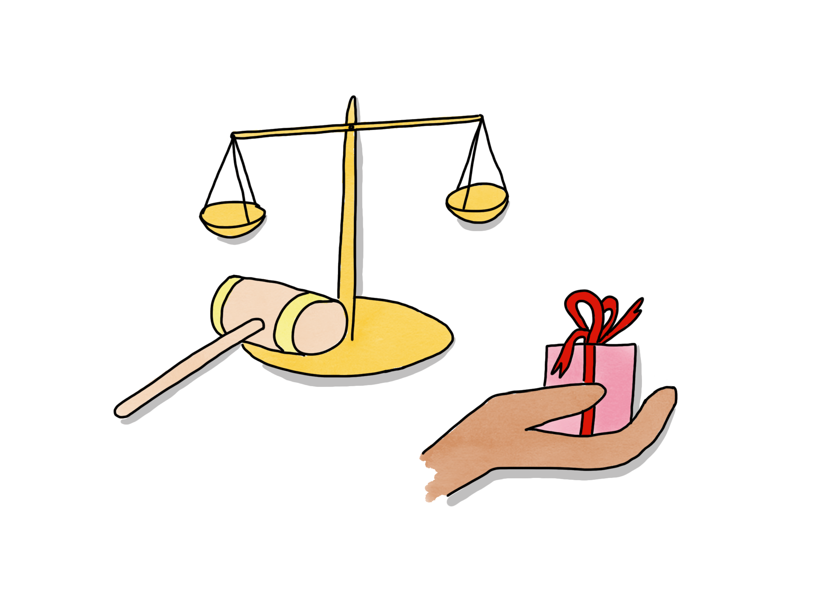

# Klargörande av teammandat

## Syfte
* Uppmuntra till mer initiativ och ansvarstagande i ett team.
* Klargöra ett teams mandat när det gäller att fatta beslut inom olika områden.
* Tydliggöra förväntningarna på ett team när det gäller att ta ansvar för olika områden.

## Tid som krävs
* 60 minuter

## Förberedelser
* [*Skriv ut*](https://management30.com/practice/delegation-poker/#download) eller [*köp*](https://management30.com/shop/delegation-poker-cards/) delegationskort, ett set per deltagare i sessionen: team + chefer.
* Förbered en lista över områden där du tror att klargörande av mandat kommer att vara användbart. Områden kan fås från personer som ansvarar för saker idag, såsom linjechefer, produktchefer, produktägare etc. De kan också fås från teamet som områden där de skulle vilja ha (ökad) påverkan eller klargöra ansvar. 
I exemplet nedan kan du se några förslag på områden som används i en verklig teaminställning.

## Hur
* Presentera anledningen till/syftet med sessionen. Vanliga exempel:
	* "Vi vill flytta mandat till självorganiserande autonoma team för att få snabbare bättre beslut". Om teamen har haft grundläggande agil utbildning kan du koppla detta till den centrala idén i agila transformationer: decentralisering för att uppnå organisatorisk smidighet.
	* Gör det klart att ett team nu förväntas ta större ansvar och att de har mandat att göra så.
	* Klargör även gränserna för teamets mandat så att team inte missförstår, onödigtvis överskrider gränser och "går in i osynliga elektriska stängsel".

* Dela ut ett set delegationskort till varje deltagare. Presentera korten: T.ex. delegation är inte svart och vitt. Mandat kan flyttas till ett team steg för steg medan de blir mer vana vid/skickliga på att fatta olika beslut.

* Gå igenom de förberedda områdena ett efter ett. För varje steg:
	* Låt varje deltagare välja den nivå av delegation som de skulle föredra för området utan att visa de andra.
	* Visa korten för varandra och ha en diskussion. Om nödvändigt, facilitera beslutsfattande. [*Femfingersröstning*](https://proagileab.github.io/agile-team-development/guides-SV/Ground-Rules-and-Decision-Making.html) kan vara en användbar teknik här.
	* Dokumentera beslut om mandat. I nästa avsnitt kan du se ett exempel på hur detta gjordes. Den gröna markeringen är önskan att delegera från chefen. Det glada ansiktet är vad teamet kom överens om/ville ha.

## Exempel

Detta är dokumentationen efter en session där en utvecklingschef ville klargöra teammandat. Den gröna markeringen är vad utvecklingschefen ville; det glada ansiktet är vad teamet ville/kom överens om.

Notera att i alla fall utom ett, var teamet ännu inte redo att ta på sig ansvaret som chefen önskade. I bara ett fall fick teamet inte den nivå av mandat de ville ha.
