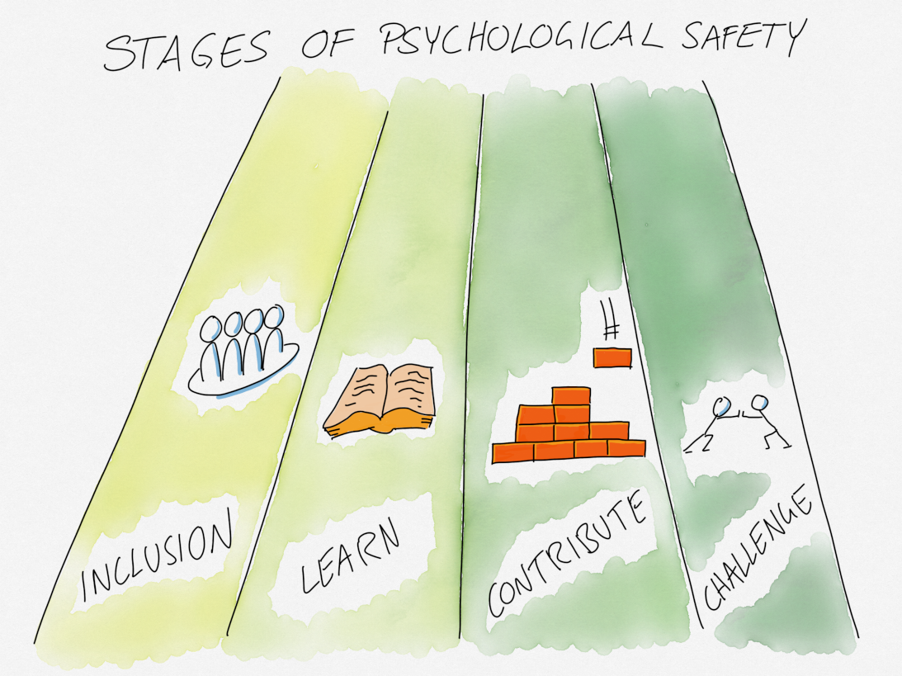

# Fyra stadier av psykologisk trygghet

## Syfte
- Förbättra den psykologiska trygghet i gruppen.

## Möjliga läropunkter
- Identifiera vad varje individ behöver för att känna sig mer säker i gruppen.

## Tidsåtgång
- 60-90 min

## Material
- Maskeringstejp
- Post-It-lappar och tuschpennor.

## Förberedelse
Skriv ut dokumentet med beskrivningarna av de fyra stadierna för alla deltagare.

Skriv även ut dokumentet med exemplen, men håll dessa två dokument åtskilda.

Skriv ned namnen på de fyra stadierna på stora lappar eller skrivarpapper, ett namn per lapp/papper:
- Inkluderingstrygghet
- Lärtrygghet
- Bidragstrygghet
- Utmaningstrygghet

Läs igenom beskrivningarna så att du har en god förståelse för varje utvecklingsstadium av psykologisk trygghet.

Dela in rummet i fyra områden med maskeringstejp och placera en lapp med namnet på ett stadie i varje område. Områdena bör placeras i en logisk ordning så att deltagarna kan röra sig från "Inkluderingstrygghet" till "Lärtrygghet", vidare till "Medverkanstrygghet" och slutligen till "Utmaningstrygghet" utan att behöva korsa andra områden. Varje stadie ska också ha en tydlig skala, t.ex. från 1 till 10, markerad på golvet.

## Hur

Introducera övningen genom att säga att psykologisk trygghet inte är en av- eller på-knapp, utan något som utvecklas gradvis över tid och genom olika stadier. Hela gruppen behöver inte vara i samma stadie samtidigt, men tryggheten i de tidiga stadierna måste byggas upp innan man kan känna sig säker i de senare.

Dela upp er i par och prata om vad hög psykologisk trygghet kan leda till.

Byt par och låt deltagarna läsa beskrivningarna av de fyra stadierna.
Diskutera sedan er uppfattning om stadierna i dessa nya par. Exempel på frågor att diskutera:
- Vad betyder stadierna för dig?
- Hur skiljer sig de olika stadierna åt?
- Känner du att du har denna trygghet?
- Hur relaterar detta till din nuvarande arbetsplats?
- ...

Låt alla röra sig i rummet och placera sig själva på skalan med de fyra stadierna ni skapat på golvet.

Para ihop dig med någon som står nära (bilda nya par) och prata om:
- Vad behöver du för att röra dig uppåt på skalan?

Efter diskussionen, läs exemplen och diskutera (fortsätt i samma par):
- Vad skulle du önska från dina kollegor för att hjälpa dig att röra dig uppåt på skalan och känna dig mer trygg?

Dela med hela gruppen de önskemål ni känner er bekväma med, som identifierats i det sista steget.

Bilda det sista paret (förhoppningsvis med en ny person) och hjälp varandra att hitta en åtgärd ni kan vidta var och en för att möta kollegornas önskemål.

## Definitioner

### Inkluderingstrygghet
Kan du vara ditt autentiska jag i ditt team? Inkluderingstrygghet tillfredsställer det grundläggande mänskliga behovet av att anknyta och känna tillhörighet. I detta stadium föregår värde värdighet. Allt du behöver göra för att kvalificera dig för inkluderingstrygghet är att vara människa och ofarlig. När du har inkluderingstrygghet kan du ta med hela dig själv till arbetet. Om du saknar det, dominerar överlägsenhet och hierarki företagets kultur. Barriärer upprätthålls och förstärks. Du kanske officiellt är en del av teamet, men utan inkluderingstrygghet kommer du inte att känna dig som en del av det.

### Lärtrygghet
Har du utrymme att växa? Lärande och utveckling är ett grundläggande behov som måste tillgodoses för att innovation ska frodas i en organisation. I detta stadium är rädsla separerad från misstag, och misstag ses som en naturlig del av inlärningsprocessen. För att kvalificera dig för lärtrygghet måste du aktivt engagera dig i inlärningen, det sker inte av sig självt. När du har lärtrygghet i din organisation uppmuntras och firas lärande. Lärande skyddas. Om du saknar lärtrygghet, döljs och bestraffas misstag, och ditt team tenderar att fokusera på att utföra snarare än att innovera.

### Medverkanstrygghet
Kan du bidra med värde till ditt team? Medverkanstrygghet tillfredsställer det grundläggande mänskliga behovet av att göra skillnad och erbjuda meningsfulla bidrag. När vi skapar medverkanstrygghet för andra ger vi dem autonomi, vägledning och uppmuntran i utbyte mot deras ansträngningar och resultat. När du har medverkanstrygghet i din organisation blomstrar teamet under ett gemensamt resultatansvar. Roller är tydligt definierade, men individer uppmuntras att tänka utanför sina roller. Små framsteg firas. Om du saknar medverkanstrygghet, ges autonomi utan tillräcklig vägledning, vilket kan få teammedlemmar att känna sig som reservspelare.

### Utmaningstrygghet
Känner du att du kan vara öppen om förändringar? Utmaningstrygghet tillfredsställer det grundläggande mänskliga behovet av att förbättra och förnya. När vi skapar utmaningstrygghet ger vi skydd i utbyte mot uppriktighet. Utmaningstrygghet ger teammedlemmar en röst att uttrycka sig när det finns möjligheter till förbättringar. Människor kan vara oeniga på ett produktivt sätt. Om du saknar utmaningstrygghet, tystnar teamet och människor bestraffas för sitt mod och sin ärlighet.

## Exempel

### Exempel på Inkluderingstrygghet

#### Ge utrymme för människor att tala
Svara, eller avbryt, inte omedelbart med din egen berättelse eller perspektiv. Håll igång samtalet och uppmuntra dina kollegor att dela med sig mer. Ju mer validering de känner när de delar något personligt, desto troligare är det att de kommer att engagera sig igen i framtiden. Detta kan skapa en mer meningsfull relation för er båda.

#### Visa nyfikenhet
Om någon ser ut, talar, äter eller beter sig annorlunda än du, visa genuin nyfikenhet. Frågor som "Kan du berätta mer om...", "Jag märkte att...", eller "Kan du lära mig..." är bra sätt att uttrycka din nyfikenhet. Äkta nyfikenhet är avväpnande och hjälper människor att känna att du genuint är intresserad av vem de är och hur de gör saker.

#### Erkänn och respektera gränser
Det kan vara svårt att sätta gränser, men våra behov är en del av vårt autentiska jag. Identifiera dina teammedlemmars behov. Låt varje person veta att du är medveten om deras gränser och kommunicera vad du kommer att göra för att respektera dem. Sätt förväntningar om att gränser ska respekteras i teamkulturen.

### Exempel på Lärtrygghet

#### Värdera ärlighet framför rätta svar
Arbete är i grunden prestationsbaserat. För vissa människor innebär det att medge att de inte vet något, att de inte kan prestera. Ärlighet kommer att föra er framåt mycket snabbare än att låtsas ha svaren. Värdera din kollegas ärlighet högre än deras upplevda oförmåga att bidra.

#### Anta inte kompetens
Det som kan kännas självklart för dig kanske inte är det för någon som är ny i en uppgift. Det är svårt att hitta balansen mellan att förklara för mycket och att göra antaganden. Frågor som "Har du gjort något liknande tidigare?" eller "Är du redan bekant med detta koncept?" kan hjälpa till att avlägsna trycket på din teammedlem att låtsas ha erfarenhet och förståelse. När du har klargjort var de står, fortsätt därifrån och fyll i luckorna.

#### Identifiera lärdomar
Misstag är mest värdefulla när du kan fastställa vad som lärdes av dem. Uttryck i ord vilken ny information du nu har som ett resultat av misstaget. Få dina kollegor att tro på de underliggande fördelarna med deras misstag.
\newpage

### Exempel på Medverkanstrygghet

#### Be om tillstånd innan du ger feedback
Ibland är det så enkelt som det! Att be om tillstånd kan dämpa en del av de emotionella riskerna som är förknippade med att ge feedback. Försök med "Hej, får jag ge dig lite feedback?" Om du får ett ja, är det mer troligt att du blir bemött med tacksamhet och uppriktighet.

#### Uppmuntra lika deltagande
Låt ditt team veta att du förväntar dig deras input. Om någon inte deltar, fråga dem vänligt om de har tankar. Ställ specifika frågor om de behöver riktning.

#### Gör förväntningar till bokstöd i ditt möte
I möten där uppgifter tilldelas och diskuteras, börja med de förväntade förväntningarna på både mötet och uppgifterna i fråga. Vid slutet av mötet, upprepa vad som diskuterades och gör nödvändiga ändringar i det inledande
\newpage

### Exempel på Utmaningstrygghet

#### Be om dåliga nyheter
Du kommer att bli förvånad över vad människor är villiga att peka ut när de specifikt ombeds leverera dåliga nyheter tillsammans med de goda nyheterna. De kommer att belysa problem som, när de är lösta, kommer att gynna ditt team. Det kommer att visa dina kollegor att du omfamnar alla aspekter av innovationsprocessen.

#### Tilldela avvikande åsikter
Om du befinner dig i ett eko-kammare, eller står knädjupt i grupptänkande, be en kollega att spela djävulens advokat. Ge dem tillåtelse att vara oense, även om de inte tror att något behöver omprövas. Ställ frågor som: "Vad missar vi här?" eller "Kan detta göras annorlunda?"

#### Visa tacksamhet för möjligheten att lära sig och förbättra
Mod är en ädel egenskap, en som inte bör tystas ned. Även om du känner dig generad av misstaget, låt inte det styra din reaktion på deras mod. De vill det bästa för dig och för din organisation, annars hade de inte nämnt misstaget från första början. Var öppen och ärlig, inte skyddad och kall. Förvänta dig samma reaktion från dem.
