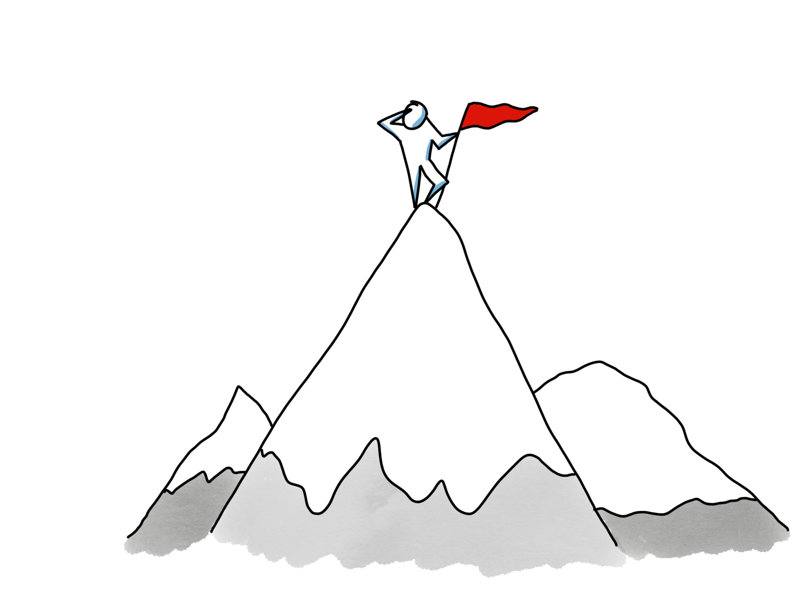
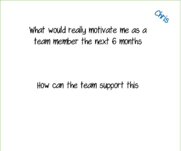

# Individuella Mål

## Tidsåtgång

Vanligtvis 1,5 timmar

## Material som krävs

- Post-its
- Pennor
- Flipchart-papper

## Syfte

- Detta är en övning för att starta och vidareutveckla ett team.
- Decentralisering, självorganisering och agil utveckling är starkt beroende av högt motiverade individer. Denna övning är utformad för att hjälpa teamet att arbeta på ett sätt som stöder individernas motivationsfaktorer.
- Det hjälper också teamet att fördela arbetet bättre eftersom varje persons preferenser blir kända för de andra.
- För ett team täcker vi vanligtvis mål från flera perspektiv:
  - Organisation
  - Produkt
  - Team
  - **Individuella &lt;- Täckt i den här guiden**

## Hur

### Del 1: Introduktion

*- Varför är du här, i det här teamet?*

*Har du tänkt på den här frågan? -) Kanske är några av er här för att er chef sa det ;-) ...men det är faktiskt mycket bättre om vi kan arbeta tillsammans för att skapa riktigt bra förutsättningar så att alla är här bara för att de verkligen vill det!*

*Så, i den här sessionen kommer vi att arbeta lite med dina individuella mål både så att du kan hitta några och så att teamet kan hjälpa dig att uppfylla dem!'*

*- Visa frågan skriven högst upp på ett blädderblock, som den på första sidan.*

### Del 2: Parvis coachning

*Så, vi kommer att göra den här övningen i tre steg, för de första två kommer vi att arbeta i par, så*

*   *Först kan ni alla para ihop er med någon... Vänta tills de har...*
*   *Nu får var och en ett blädderblockspapper och fyller i den som mitt exempel*

*Vänta...*

*   *De närmaste 15 minuterna kommer en person per par att fylla i toppen av sin affisch. Det kan faktiskt vara svårt att hitta bra svar på den här frågan ensam, så det är därför vi kommer att arbeta i par. En person kommer att fylla i toppen av affischen och den andra kommer att vara "coach"!*
    
*   *Coachens ansvar är inte att komma med förslag, utan att ställa frågor för att hjälpa den andra personen att utforska sina egna tankar och organisera dem.*

Den sista delen innehåller några förslag på frågor som en coach kan ställa. Skriv ut dem så att alla coacher kan ha en. Låt dem ha lite tid att studera den innan du börjar.

Sedan låt dem gå i 15 minuter och be dem sedan att byta.

### Del 3: Teamstöd för individuella motivationsfaktorer

*Nästa*

1. Låt varje person beskriva sin affisch för teamet.
2. När de pratar, låt teamet göra anteckningar om hur de (som ett team och individer) kan stödja personen för att nå det de behöver/vill ha.
3. Samla teamets förslag längst ned på varje flipchart-papper.
4. Underlätta diskussionen så att åtgärderna är tydliga och nästa steg för varje stödåtgärd fastställs.
5. Underlätta beslutsfattandet, ange förslagen och låt teamet samtycka med hjälp av "fist of five" röstning till exempel.

## Exempel på coachningsfrågor

  - När var det senast du verkligen trivdes med arbetet?
  - Vad gillade du med det?
  - Vad mer...?
  - Vilka är några av de saker du tycker om med arbetet?
  - Hur kände du när du... &lt;uppnådde något&gt;?
  - När var en annan gång du hade den känslan?
  - Kan du komma ihåg en tidpunkt när du kände dig riktigt nöjd/exalterad/glad?
  - Säg något mer om det...?
  - Vad får dig att känna dig levande?
  - Vad motiverar dig?
  - Vad är dina intressen?
  - Vad är det med det arbete vi gör som gör dig exalterad?
  - Vad skulle du vilja lära dig?
  - Vad mer skulle göra dig riktigt glad över att ha varit i det här teamet?
  - Vad mer skulle du vilja uppleva i det här teamet?
  - Jag hör att du verkligen gillar &lt;...&gt;.
  - &lt;...&gt; verkar viktigt för dig.
