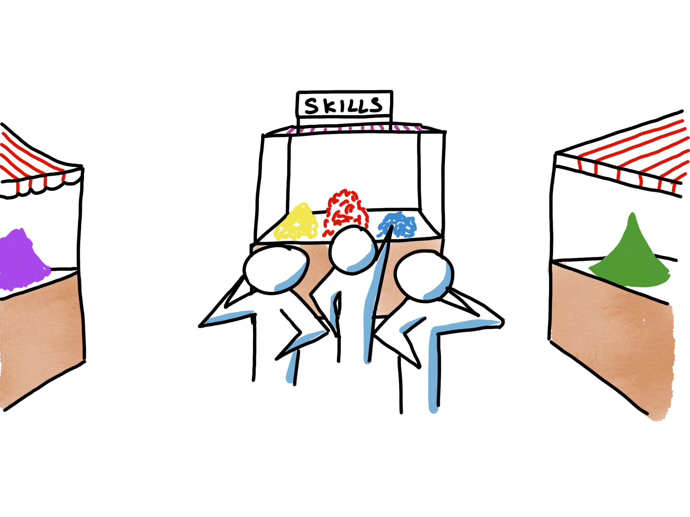
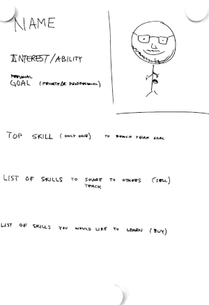

# Market of skills   

## Syfte

- Göra färdigheter som teamet har synliga för hela teamet.
- Öka delningen av färdigheter bland teammedlemmarna.

## Möjliga lärdomar

- Genom att göra våra färdigheter synliga för andra kan vi lära oss bättre av varandra.

## Varaktighet

- 30-60 minuter

## Material

- Ett A3-papper för varje deltagare.
- Pennor i olika färger (inte nödvändigt men definitivt en bonus) och permanenta pennor.

## Hur

- Bjud in varje person att skapa sin egen affisch. Visa en mall för hur affischen kan se ut. Den ska innehålla följande: (10-15 min)
   - Namn
   - Självporträtt
   - Intresse eller förmåga (som är okända för andra, kan vara relaterade till yrkes- eller privatlivet)
   - Personligt mål (kan vara privat eller professionellt)
   - Min främsta färdighet som kommer att hjälpa oss att nå vårt mål
   - Färdigheter som jag kan dela med mig av till andra (sälja)
   - Färdigheter jag skulle vilja lära mig (köpa)
- Bjud in varje person att presentera sin affisch. (1-3 min/person)
- Bjud in gruppen att självorganisera sig för att komma överens om en köp- och en säljtransaktion per person. Vad man ska köpa, vad man ska sälja och hur man tar nästa steg tillsammans. (10 min)
