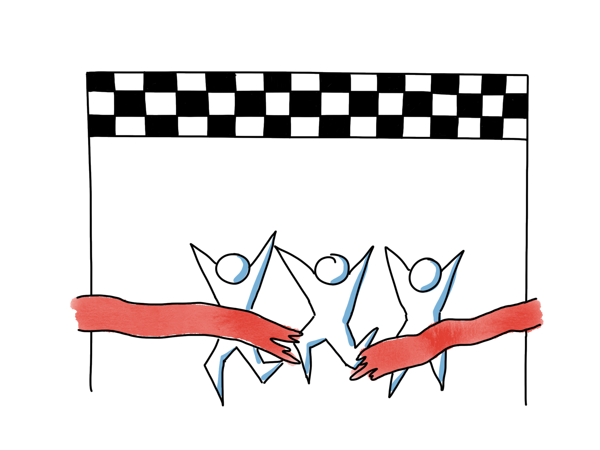

# Organisatoriska mål för team

## Tid som krävs
Vanligtvis 30 min - 1 timme, beroende på hur okända/ojämförbara visionen och målen är för teamet.

## Nödvändigt material
* Orange & gröna post-it-lappar
* Markörer

## Syfte
Det här är en övning för teamstart/teamutveckling. Syftet är att teamet ska få lära känna sitt syfte mer i detalj, för att de ska kunna bearbeta det, diskutera det, förstå det och internalisera det.
Att ha ett tydligt, engagerande syfte är den viktigaste faktorn när det gäller hur ett team presterar. Utan ett gemensamt mål finns inget team.

För ett team täcker vi vanligtvis mål från flera perspektiv:

* **Linjeorganisation &lt;- täcks i denna guide**
* Produkt
* Team
* Individ

## Förberedelser
Boka några förberedelsesessioner med en linjechef ansvarig för teamen. De behöver presentera den organisatoriska/arbetssättets vision/mål vid sessionen. Räkna med minst 1+2 timmars förberedelser med några dagar emellan för att skapa attraktiva visioner/en övertygande riktning från organisationens synvinkel.

Syftet med att linjechefen deltar i denna session är:

- Förklara skälen till agila förbättringsinsatser/agil transformation på ett sätt som energiserar teamet.
- Förklara vad som förväntas av teamet som ett agilt team, förutom att utveckla produkt. Detta är vanligtvis:
  - Äga sina egna arbetssätt och kontinuerligt förbättra dem, d.v.s. de behöver vara experter på agila arbetssätt i tillägg till experter inom programmering/UX/testning etc.
  - Arbeta närmare och som ett team istället för som individer. Bredda kompetenser, fokusera på teammål och hjälpa till inom områden där du inte har superkompetenser, men där det är meningsfullt att uppfylla teammålet.
  - Förfina och förbättra färdigheter inom kommunikation, beslutsfattande, problemlösning och konflikthantering för att kunna nå en verkligt väl fungerande nivå av självorganiserande team.
  - Lära sig nya färdigheter inom ditt område relaterat till hur man utför det med agila verktyg och tekniker (t.ex. testdriven utveckling, refaktorering, Lean UX, Agile testing etc).
  - Ta helhetsansvar inklusive krav, testning och distribution.
  - Synkronisera direkt med andra team istället för att förlita sig på andra för att göra detta.
  - ...

Visionen om varför vi försöker bli mer agila och hur vi vill att teamen ska utvecklas behöver vara intensiv, emotionell, personlig.

Några idéer om hur man når det i förberedelsesessionen är nedan:

- Undvik powerpoints. Kommunikation människa till människa är oftast bäst utan det.
- En personlig berättelse är ett av de mest effektiva sätten att kommunicera en vision. Detta kommer från 100 000 år av mänsklig historia av berättande runt lägereldar innan vi uppfann mer avancerat skriftspråk, så det är ett unikt testat och effektivt sätt att förmedla information och motivera/energisera andra.

- Ordval och uttryck bör vara personliga och använda känslor. Ord som stolt, exalterad, ledsen etc. är bra att använda. Vi vill inte ha torrt "professionellt" språk.
- Bra berättelser om arbetssätt kan ha sitt ursprung i exempel. Be linjechefen att nämna några exempel på när vi arbetar som bäst i denna organisation. Letar efter exempel där vi redan arbetar nära som ett tvärfunktionellt team med ett tydligt syfte, hög behörighet att fatta beslut, nära kunden, korta återkopplingscykler för att leverera maximalt värde, etc.
- Ibland dyker olika "arbetsgrupper" upp som exempel. Detta är ganska likt det vi vill uppnå med agila team, tydliga mål, alla rätt personer, hög beslutsmakt, ingen byråkrati. Men också poängtera att vi vill göra det med ett hållbart tempo och hög kvalitet.
- Kanske kan visionen sammanfattas i några nyckelord (max 3-5) och/eller en liten bild. Uppmuntra live-teckning av visionen/bilden.
- Att tänka på "mottagaren" är alltid bra, vad innebär det för teamet, för individerna. Betona dessa aspekter.

## Hur
  *Som ett agilt team är ni också en mycket viktig del av vår agila transformation. Typen av agila team vi försöker odla och utveckla nu är förmodligen också ganska annorlunda än de team du har varit i tidigare. Kanske till och med om de har kallats "Scrum-team". Så idag har vi vår linjechef här för att förklara och diskutera vad det är organisationen vill uppnå när det gäller arbetssätt och hur det påverkar ert team.*

  *Medan vi pratar kommer ni alla att skriva några kommentarer på orange och gröna post-it-lappar. Gröna post-it-lappar för tydliga målriktningar som ni hör. Orange för punkter ni känner kan vara tydligare eller som ni skulle vilja diskutera.*

  - Låt linjechefen göra presentationen. Efteråt, samla alla tydliga/oklara post-it-lappar på några flipcharts. Facilitera en sammanfattning av de gröna och en diskussion/klargörande av de orange tillsammans med linjechefen.
  - Spara de fysiska resultaten för användning i senare retrospektiv och andra sessioner.
