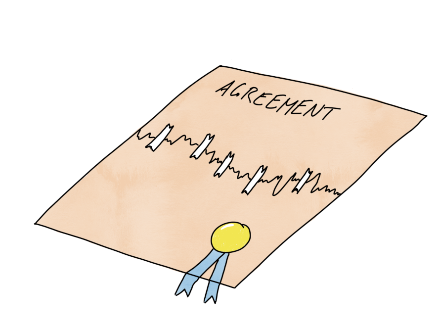

# Att reparera brutna överenskommelser

## Tid som krävs:

30 min

## Syfte:

- Motivera team att göra överenskommelser och att hålla varandra ansvariga för det som har överenskommits
- Efter session ska deltagarna ha mod, motivation och förmåga att ta upp en bruten överenskommelse och färdigheterna att reparera den
- När team övar på denna teknik ökar den grundläggande känslomässiga säkerheten i teamet, vilket gör det mycket enklare att utvecklas som team

## Förberedelser

- Skriv ut rollstudier från nästa avsnitt för alla. Varje person ska få antingen "Chris"- eller "Sam"-versionen.

- Be en medfacilitator eller någon i sessionen om de kan demonstrera tekniken med dig. Se exempel längre ner. 

## Hur

(Sessionen nedan har designats med 4c-lärandeansatsen från konceptet "Training from the back of the room")

**Uppvärmningsfråga**: Har någon upplevt att en teammedlem inte riktigt betedde sig på ett sätt som ni tycker är okej i ert team, men ni lät det passera eftersom ni trodde att ta upp det det skulle vara obekvämt eller leda till konflikt?

**Koncept**

*För att börja med är det en subjektiv fråga om någons beteende är okej eller inte. Någon kan tycka att det är helt okej att äta en droppande taco medan de lånar ditt tangentbord och kanske inte förstår varför du springer fram och skriker utan anledning...*

*Därför är det en bra idé att i ett team försöka sätta några regler som alla känner till och kan gå med på. Det kan handla om kvalitet, hur nära man ska arbeta tillsammans, tider, roller och möten etc. Det behävs inte så många, 6-7 kan räcka. *

Hur man kan gå tillväga för att skapa teamöverenskommelser kan du se i en annan övning i den här samlingen.

Så, vad ska du göra då om någon inte följer det som har överenskommits? Vem tar upp det? En regel som behöver finnas bland varje teams överenskommelser är att när någon märker att en annan medlem inte följer teamets överenskommelser, måste den personen ta upp det direkt och reparera överenskommelsen. Det är viktigt, för när en överenskommelse har brutits finns den egentligen inte längre och det finns en stor risk för att "[*krossat fönstersyndrom*](https://whatis.techtarget.com/definition/broken-window-theory)" kickar in.

*För att förhindra att detta händer i ditt team kommer var och en av er nu att få öva på att ta upp något obekvämt med en kollega och reparera en bruten överenskommelse, men vi kommer att göra det på ett helt säkert sätt med hjälp av några påhittade fall som ni kommer att få rollspela.*

*Här är mallen som jag vill att ni provar när ni gör detta, den är från den duktiga teamcoachen Christopher Avery.*

**Exempel**

- *Först visa med hjälp av ett exempel, du kan ha förberett någon i klassen att göra detta eller göra det med en medfacilitator

   ***Du***: *Sam, jag tittade i koden och det verkade för mig som att du checkade in en massa kod igår kväll utan några tester, stämmer det?*

   ***Sam***: *Ja, det stämmer. Det var en kris och jag var tvungen att etc etc*

   ***Du***: *Åh. Jag förstår. Det gör mig lite orolig nu att vi får kod utan automatiska tester i systemet. Vår teamregel att inte checka in något utan tester har varit riktigt bra för mig. Jag har känt mig mycket bekvämare med att ändra saker och vi blir inte så störda av felrapporter. Jag är rädd att om vi börjar slarva här med testningen så kommer vi snart att vara tillbaka där vi började. Vad tycker du om regeln att aldrig checka in kod utan tester?*

   ***Sam***: *Jag tycker att det har varit bra. Jag var superstressad igår och hade inte tid, det är allt.*

   ***Du***: *Tror du att vi behöver ändra vår regel för att bättre hantera situationer med hög stress?*

   ***Sam***: *Nä, jag tror det är bäst om vi behåller den som den är. Jag ska lägga till testerna nu och ta det lite lugnare nästa gång. Kanske kunde vi programmera parvis mer i sådana situationer för att hjälpa oss att inte ta genvägar när vi är stressade.*

   ***Du***: *Låter bra! Låt oss prata med de andra i teamet om hur vi ska lösa den sortens situation bättre tillsammans framöver! &lt;skaka hand&gt;*

*Vad tycker ni? Kan ni ta upp något obekvämt på detta sätt?*

**Mall**

Visa deltagarna mallen nedan. Skriv upp det på en tavla och visa att detta är vad du precis demonstrerade:

1. Ta upp vad du har märkt, kontrollera om den andra personen håller med om vad du har märkt?
1. Berätta för den andra personen vad överenskommelsen betyder för dig och varför du vill behålla den.
1. Fråga den andra personen om deras syn på överenskommelsen
1. Fråga om överenskommelsen behöver ändras för att fungera för den andra personen
1. Fatta ett beslut om en ny överenskommelse eller besluta att behålla den gamla.

**Konkret övning**

*Nu ska var och en av er få öva på den här tekniken. Jag kommer att ge er ett manus med några påhittade fall och rollstudier. En av er kommer att spela Sam, en kommer att spela Chris.*

*I det första fallet kommer Sam att ta upp en bruten överenskommelse med Chris och i det andra fallet kommer Chis att ta upp något med Sam.*

*Försök att använda mallen som jag visade er.*

Dela ut [*fallen*],
(tilldela varje person att vara antingen Sam eller Chris)

låt dem göra det, ställ några debriefing-frågor och uppmuntra dem,. Det lät jättebra! Massor av konflikter i rollen och alla överlevde! Hur kändes det? Vad lärde ni er?

*Vad tar ni med er från denna övning?*

**Avslut**

*Gör en anteckning om hur och när ni kan använda denna teknik tillbaka på jobbet. Hur kan ni introducera den för andra?*

## Rollstudie för person som spelar "Sam"

## Fall 1: Tvåveckorsplanering

### Bakgrund:

Regeln i ditt team är att alla ska prioritera att delta i en planeringssession inför varje tvåveckorsperiod. Ni skapade regeln eftersom ni ville ha allas perspektiv under planeringen. Chris dök inte upp vid den senaste sessionen. Ni saknade en del av hans input och kunde inte riktigt göra klart planeringen.

### Din uppgift:

Initiera en diskussion med Chris om den brutna överenskommelsen. Använd Christopher Averys teknik för att reparera brutna överenskommelser:

1. Ta upp vad du har märkt, kontrollera om den andra personen håller med om vad du har märkt?
1. Berätta för den andra personen vad överenskommelsen betyder för dig och varför du vill behålla den.
1. Fråga den andra personen om deras syn på överenskommelsen
1. Fråga om överenskommelsen behöver ändras för att fungera för den andra personen
1. Fatta ett beslut om en ny överenskommelse eller besluta att behålla den gamla.

## Fall 2: Arbete hemifrån

### Bakgrund:

Ditt företag tillåter en blandning av fjärr- och kontorsarbete. För dig är arbete hemifrån ett utmärkt sätt att fokusera bättre. Särskilt på fredagar när det finns få andra möten är detta bra! Du kollar fortfarande meddelanden, men ibland stänger du av dem när du verkligen behöver fokusera på något.

## Rollstudie för person som spelar "Chris"

## Fall 1: Sprintplanering

### Bakgrund:

Ditt tandläkarbesök var under tvåveckorsplaneringen så du kunde inte delta. Du visste redan det mesta av
vad du skulle arbeta med så det var ingen stor sak.

## Fall 2: Arbete hemifrån

### Bakgrund:

Din organisation tillåter en blandning av fjärr- och kontorsarbete. Ditt team har kommit överens om att försöka samlas på kontoret åtminstone på tisdagar och fredagar. Sam mailar dig för tredje fredagen i rad: "Jag kommer att jobba hemifrån idag, jag kan nås via mail och chat". Du känner att fördelarna med kontorsarbete minskar när Sam fortfarande är på distans och ibland svarar han inte ens så snabbt.

### Din uppgift:

Initiera en diskussion med Sam om situationen. Använd Christopher Averys teknik för att reparera brutna överenskommelser:

1. Ta upp vad du har märkt, kontrollera om den andra personen håller med om vad du har märkt?
1. Berätta för den andra personen vad överenskommelsen betyder för dig och varför du vill behålla den.
1. Fråga den andra personen om deras syn på överenskommelsen
1. Fråga om överenskommelsen behöver ändras för att fungera för den andra personen
1. Fatta ett beslut om en ny överenskommelse eller besluta att behålla den gamla.

