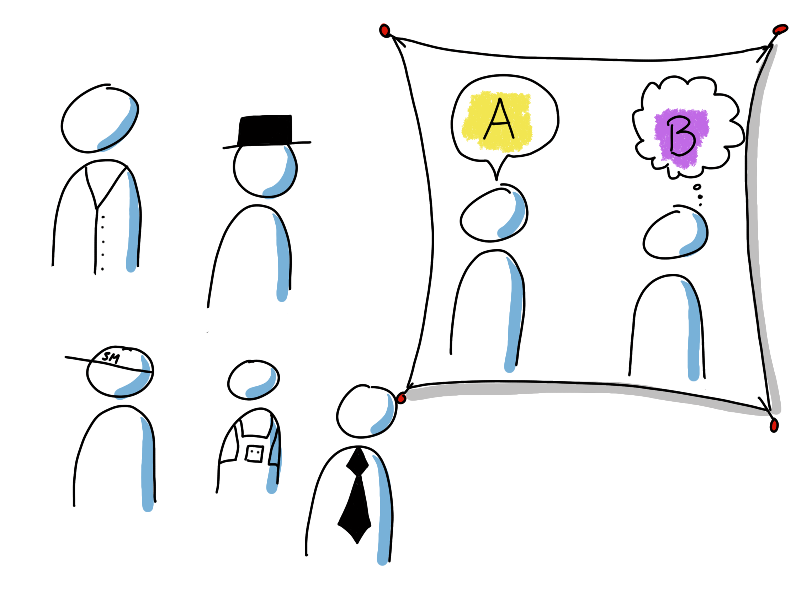
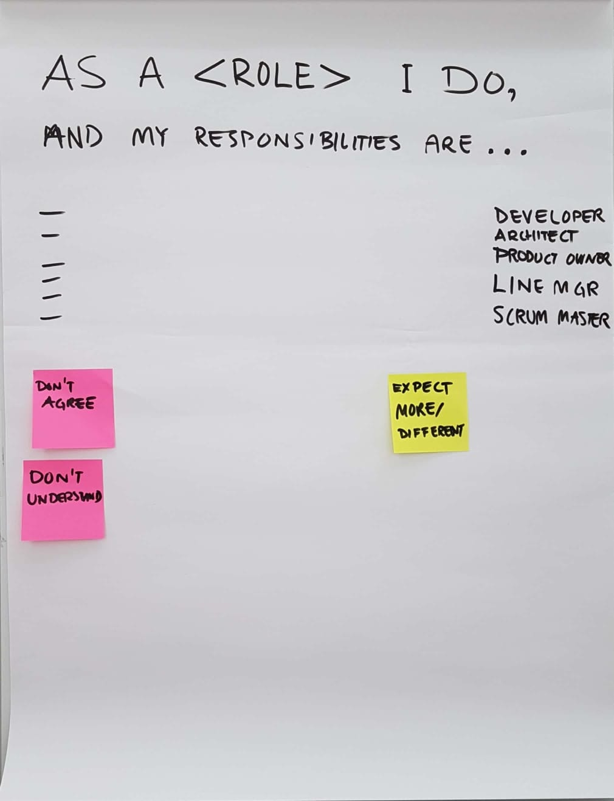
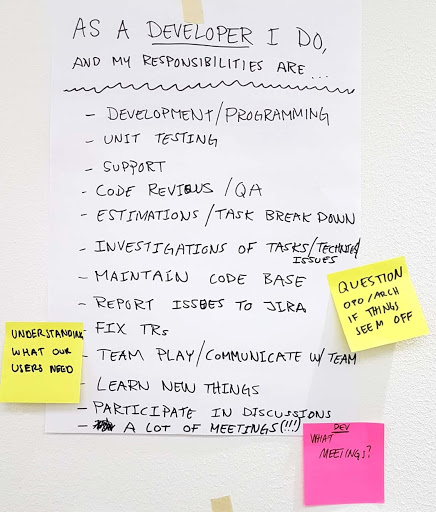

# Roller och Förväntningar

## Syfte
-  Klargöra de olika rollerna och förväntningarna på rollen (den som har rollen och de andra).
-  Genom att klargöra rollerna förstår vi våra aktiviteter och ansvarsområden bättre och kan arbeta bättre tillsammans med färre antaganden om vem som gör vad.

## Varaktighet
-  30-60 min

## Material
-  Ett flipchart-ark eller A3-papper för varje deltagande roll.
-  Post-it-lappar (minst två olika färger) och tuschpennor.

## Hur

-  Skapa en flipchart som en mall med meningen “Som en <roll> gör jag ... och jag är ansvarig för…”
   1.  Bjud in varje roll att skapa sin egen affisch (flipchart eller A3). Om mer än en person har samma roll (t.ex. utvecklare) ska de skapa en affisch tillsammans. (10-15 min)
   2.  Bjud in varje roll att presentera sin roll. (1-3 min/roll)
   3.  Bjud in de andra att ge feedback. De ska ha post-it-lappar i två olika färger. De skriver ner det de inte håller med om eller inte förstår på en färg av post-it-lapparna. Den andra färgen är för saker de saknar i rollbeskrivningen. Sätt upp post-it-lapparna på affischen. Inga kommentarer än. Upprepa detta och föregående steg för alla roller. (1-3 min/roll)
   4.  Bjud in varje roll att reflektera över den feedback de har fått och vara förberedd för en gruppdiskussion. (5 min)
   5.  Bjud in varje roll att svara på feedbacken och ha en gruppdiskussion om oklara och saknade saker. Upprepa för alla roller. (10-20 min)

