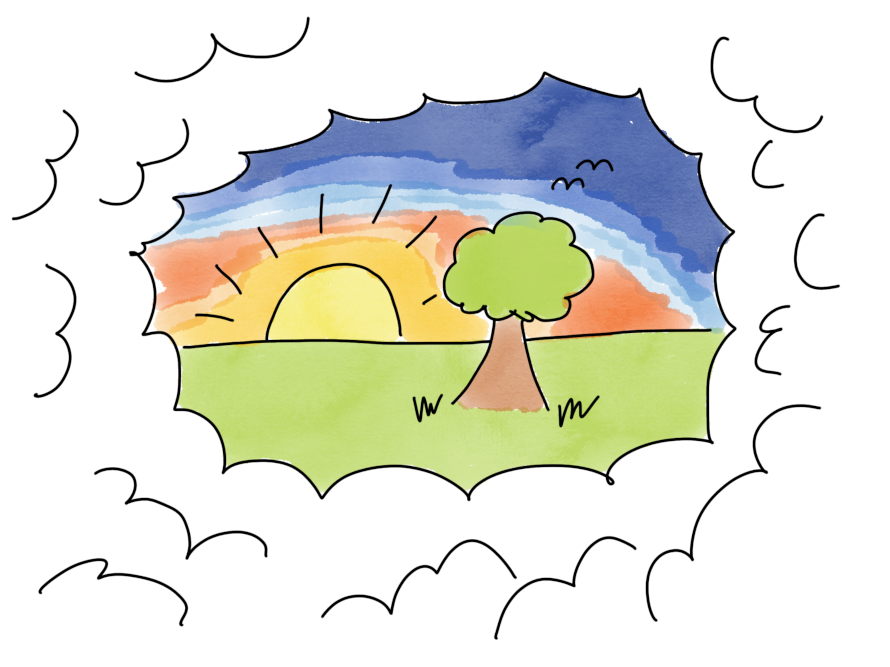

# Teamvision

## Tid som krävs

Vanligtvis 1 timme

## Nödvändigt material

- Olika sorters post-it-lappar
- Filtpennor som ger tydligt läsbara post-it lappar
- Färgade pennor
- Blädderblockspapper
- Whiteboard, eller ännu bättre ett längre pappersark/portabel whiteboardplast att sätta upp på väggen för visionsberättelsen

## Syfte

Syftet är att teamet börjar definiera sig själva som ett team genom att skapa en gemensam vision om vilket team de vill vara.

För ett team täcker vi vanligtvis mål från flera perspektiv:

- Organisation
- Produkt
- **Team &lt;- Täcks i denna guide**
- Individ

## Hur

### Intro

*Nu har vi hanterat några av målen från organisationen och produktledningen.*

*Den här sessionen kommer att handla om er och hur ni vill att ert team ska vara. Om vi vill att detta ska vara en riktigt bra teamupplevelse, kanske en av de bästa i din karriär hittills, så kan det vara rimligt att spendera lite tid på att få allas input på hur en riktigt bra teamupplevelse skulle se ut!*

*Om ni är överens om vad ni strävar efter ökar chansen att ni kommer dit, låter det vettigt?*

### Uppvärmning -&gt; parvis

*Okej, som en uppvärmning, vill jag att ni alla först tänker på en riktigt bra upplevelse som ni har haft i ett team. Det kan vara på jobbet eller inom sport etc., vilket som helst team. Gör några anteckningar om vad som hände och fundera även på vad som gjorde det så bra. Nästa steg blir att prata parvis, men låt oss börja individuellt först i några minuter. Vad var det bästa teamet du varit med i, vad gjorde det så bra?*

*Starta en timer för att undvika att avbryta dem innan de ens har börjat. Ge dem 4-5 minuter.*

Anledningen till att vi vill att de ska skapa sin nya teamvision baserat på erfarenheter snarare än tomma slogans är att förankra den djupare genom att ha den, återigen, baserad på personliga berättelser.

Vissa människor tänker bättre när de får lite individuell tid först, att låta alla först skriva tyst är utformat för att göra det lättare för dem. Efter 4-5 minuter, om alla verkar ha kommit igång, avbryt dem och be dem sedan bilda par och dela med sig av vad de kom att tänka på.

Jag har också gjort detta direkt i parvis diskussion och jag tror att det fungerade bra också, även om teorin säger att den tysta skrivstarten förmodligen är bättre.

### Undergrupper -&gt; nyckelord

*Efter några minuters parvis delning, börja samla in resultat. Om teamet är större än 6 personer, fortsätt arbeta med undergrupper om 3-4 personer. Be varje undergrupp att skriva ner några nyckelord från sina berättelser - om detta var det bästa teamet du någonsin har jobbat i - hur skulle du beskriva det*

### Undergrupper -&gt; visualiseringar

*Ibland i det förflutna har vi bett team att skapa en målslogan, som "vi är modiga och innovativa och arbetar alltid tillsammans med kunden" - vilket kan vara en trevlig sammanfattning av vad ni har diskuterat, men kanske lite torrt och inte så inspirerande. Idag kommer vi att skapa två andra representationer av er teamvision. För att börja med vill jag att varje undergrupp illustrerar med en liten teckning med hjälp av de färgade markörerna på ett blädderblockspapper vad ni tycker visionen för ert team bör vara. Så, ta 15 minuter att visualisera vad ni kom fram till och sedan kommer ni att få presentera det för den andra undergruppen.*

Dela ut färgade pennor och blädderblockspapper och starta en timer

Låt dem presentera för varandra och facilitera diskussioner om likheter och skillnader i undergruppernas visualiseringar. Finns det några områden som behöver beslutsfattande eller kan alla teammedlemmar köpa in på teamvisionen som visualiserats. Facilitera diskussioner och eventuellt beslutsfattande.

### Hela teamet -&gt; Visionsberättelse

*Okej, tanken med detta är att hjälpa er att diskutera och komma överens om vad ett riktigt bra team skulle vara för er, något som ni kan berätta historier om till era barnbarn när ni sitter i er gungstol på er veranda.*

*Vilket leder oss till den sista övningen för detta ämne. Nu ska vi se om vi kan få med dessa fantastiska visionsteckningar i vårt vardagliga arbete här. Vi gör det genom att skapa något som vi kallar en "visionsberättelse". Syftet med en visionsberättelse är att göra detta ännu mer konkret och lätt att minnas. Hjärnan är faktiskt unikt bra på att minnas berättelser eftersom det är så all mänsklig kunskap förmodligen förmedlades runt lägereldar tills vi lärde oss mer avancerad skrift.*

*Så nästa steg är att skapa en berättelse som ni kan använda senare när ni pratar med varandra och planerar ert arbete och när ni märker att ni avviker från era visioner. Då kan ni alltid hänvisa till er berättelse. "Teamet...vi gör inte som vi sa!"*

*Så, vi kommer att göra detta i två delar*

- *Välj något som ni kan arbeta med som ett team som skulle göra det möjligt att inkludera alla eller de flesta delarna från era visionsteckningar. Det kan vara ett produktmål eller något annat ni vet att ni kommer att jobba med ihop*
    
- *Skapa en tidslinje för berättelsen här som visar hur ni slutför arbetet som ett team, och beter er precis enligt er fantastiska teamvision! Ni kan använda text och små bilder, hur ni än vill!*

*Om 15 minuter skulle jag vilja se och höra er berättelse!*

Lyssna på deras berättelse, fråga dem om den täcker visionsteckningarna? Om inte, kan den justeras för att inkludera allt? Fråga sedan kommer ni att göra detta, på det här sättet på riktigt? Facilitera beslutsfattande.

När allt är klart, fira med en omgång high fives eller något! När ni har gjort denna uppgift på det här sättet kommer ni aldrig att glömma er ambitiösa teamvision!
