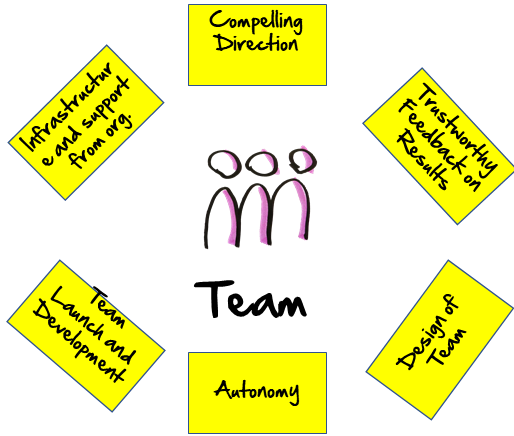
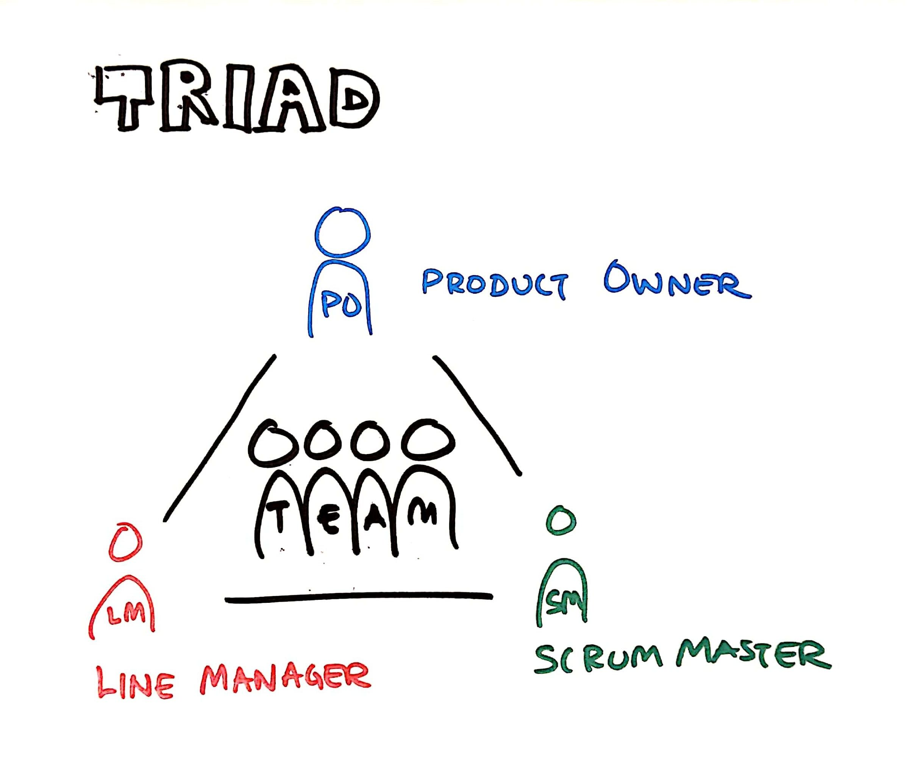
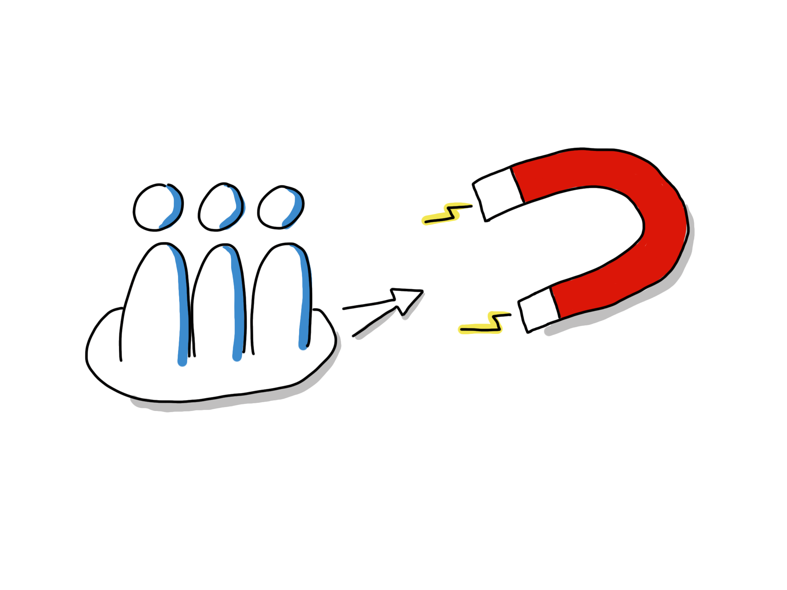
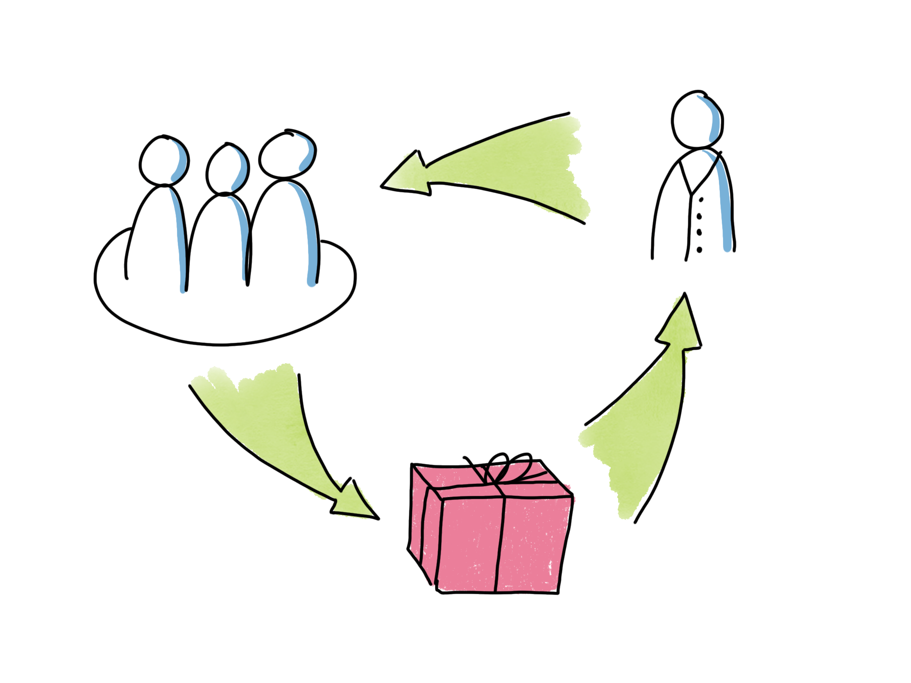
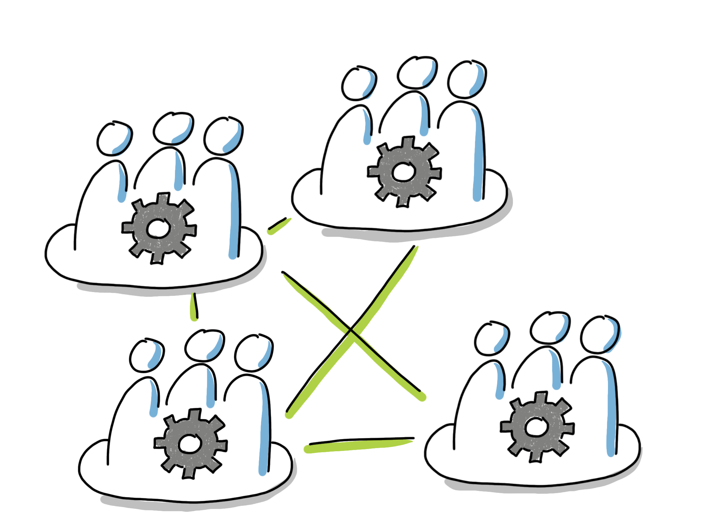
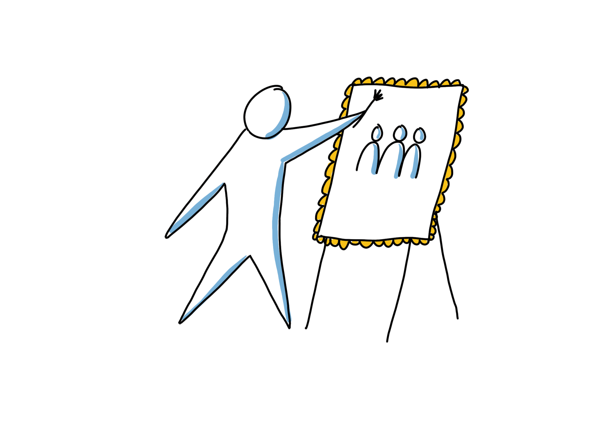
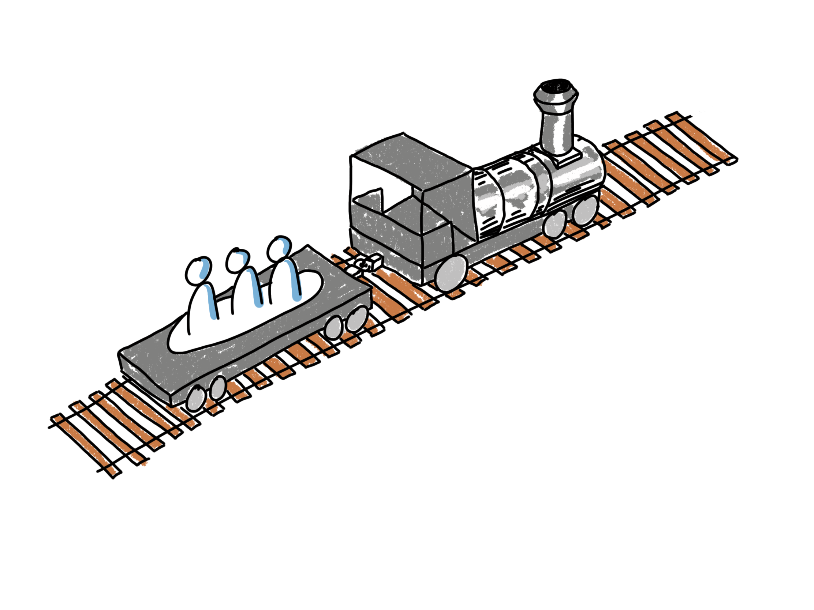

# A Team Development Framework

## Why teams don't work

A well-functioning team can create magic, but here are some disturbing facts from teamwork in the real world:

* Research that compares the performance of teams with what is produced by an equivalent number of individuals who work by themselves almost always find that the individuals outperform the teams [1].
* In practice five out of nine interventions/attempts to improve team performance have no positive effect whatsoever! [2]
* There is much agreement in the research community on what works and not when it comes to helping teams get to high performance. 

So, in theory we do know how to make things work. In practice, organizations do not apply this knowledge when starting and developing teams. Thus, they fail to get the full benefits from organizing in teams. 

To help with this situation, we decided to put this simple guide together. It contains a framework and some hands-on exercises that you can use to start and support the agile teams in your organization. We created it to support Scrum Masters, Line Managers, Agile coaches and others that want to create great teams.

To avoid falling into the trap of the five out of nine techniques that sounds good but actually do not help at all, we based this guide on principles well grounded in the research. 

This is not only a theoretical framework though. We have used it at ProAgile for more than ten years of helping agile teams to get started and keep improving. For us it has helped to create good results in practice. We hope you will find it useful too.

### References

[1] Why Teams Don’t Work, Diane Coutu, Harvard Business Review May 2009

[2] Creating Effective Teams, Susan A. Wheelan

## What is a successful team?

Before we go into describing how to create a successful team, let’s agree what we mean with “a successful team”. Below you can see a proposed definition from Richard Hackman. A successful team:

* actively shape stakeholder expectations and then exceed them
* grow as team, becoming more and more capable of taking on greater challenges together
* grow as individuals, increasing individual skills, both soft and hard

Relative weight of these bullets differs depending on the purpose of the team. For a team that will work together a lot over a long time, all bullets are important. If you are interested in a team like that, this booklet may be for you!

## The Framework

Above you can see a visualization of a framework that has been proven useful for us when thinking about how next we best can help a team on their journey. 

The six areas shown with the yellow postits above is a slightly different way of viewing the five conditions that well renowned team researcher Richard Hackman uses to discuss team performance in his work[3]. 

Hackman states that evaluating a teams environment and setup, using these areas, can explain 90% of the variation you see in team performance! This is great news since it also means that by focusing on these areas, by improving the working conditions of your teams step by step, you can have a huge impact on the performance of the teams that you care about!

### How to use this framework

Here is one suggestion on how to use the framework:

* Identify the leaders that most closely care about/can influence the conditions of performance for a team. 
In a classic agile context this may be the Product Owner, Scrum Master and Line Manager of the team.
* Schedule regular get-togethers of these leaders.
* At these gatherings, use the framework to systematically examine the working conditions of your team. What is in place already? What would be a next step to enable even greater team performance within each area?
* Pick at least one area where you would like to make an improvement, plan and execute an experiment to make the improvement. The exercises later in this paper can be useful to make some of these improvements. 
* Repeat.

In the next sections we will examine each of the conditions/areas one by one. This is for you to use as a reference when you evaluate the conditions for each team and think about next steps as descibed above.

# The Six Key Areas

## Compelling Direction

This is the most important of the various factors you should consider when thinking about what conditions you can help create for your teams. 
It is one out of five factors identified by Hackman as enabling team performance. 
Wheelan found that this was one out of three factors that really mattered when examining effective team interventions. 
In the Google Aristotele research [4], three out of five key conditions found to affect performance, was goal related.

Thus, a team need somewhere to go, a direction that they feel compelled to travel together in! 

A team may have many different types of goals that serves to set this compelling direction. They can be: 

* Product development related
* Organizational development related
* Team related
* Individual related

Creating and processing these goals is one of the very first steps to help any team reach high performance. In the second part of this booklet there are many exercises to help you do this in a good way.

What we are looking for is a direction that:

* Requires the whole team to work together. If the team does not need to work together to reach the goals, there is no need for a team. If you give goals to teams that individuals can reach individually, you should not expect teamwork to emerge.
* Is conceived by the team as quite challenging, but possible.
* Will fuel the intrinsic motivation in the individual team members.

### Some techniques that are useful in this context

* Impact mapping
* Value Proposition Canvas
* Business Model Canvas
* Sprint Goals
* Helping the team to be close to and empathize with the people that will benefit from the solution/service they are delivering. In a Scrum context this may be reached by encouraging close collaboration between team and stakeholder and avoiding go-between behavior from roles such as Product Owners.

### Related exercises from part 2

* [*Individual Goals*](https://proagileab.github.io/agile-team-development/guides/Individual-Goals.html)
* [*Organizational Goals for Teams*](https://proagileab.github.io/agile-team-development/guides/Organizational-Goals-for-Teams.html)
* [*Product Goals for Teams*](https://proagileab.github.io/agile-team-development/guides/Product-Goals-for-Teams.html)
* [*Team Vision*](https://proagileab.github.io/agile-team-development/guides/Team-Vision.html)

## Timely and Trustworthy Feedback

This is also one of the top three important aspects to consider when trying to create the conditions for team performance. 

I once worked with a team that seemed to have a pretty good time at work, but when it came to the work itself, I felt that their hearts were not really in it. At the end of sprints they shipped whatever they had without worrying so much if what they shipped was of sufficient quality, if it really worked or if it was of value.
 
Now this team were a part of a larger organization and did not have all the equipment they needed to test if what they had created actually worked or not. At the end of sprints they simple shipped stuff off to another team that would test it. So I asked them, "how long does it take before you get feedback from the test team?". The answer I got was that "It can take up to 18 months!"
 
Clearly waiting so long for feedback on what you are doing is not the most inspiring working environment. Basically, you get the feeling nobody cares what you do and that it doesn't matter anyway. What looked like disengaged, somewhat irresponsible, individuals was merely a logical result of setting up an environment that created that behavior!
 
### Some techniques to address this condition

* Create real potentially releasable increments of your product/service as frequent as possible. At least every sprint.
* Slicing stories vertically so that even each releasable increment is created in many smaller steps, each giving technical feedback about working integrations etc.
* Making sure teams have frequent stakeholder, customer and end-user contact. In Scrum this can be during Sprints and at Sprint Reviews. 
* Techniques such as impact mapping from the compelling direction section that makes sure the team actually know what the purpose of the work is. Without that, any measure of progress is less meaningful.

## Clear and Significant Autonomy

Here is a pattern I keep running into when I work with aspiring agile organizations:
 
After some initial agile training, teams assume that they now are self-managing and happily set out to decide various things. Shortly after, their initiatives will be shot down by managers that still have the perception that whatever was decided is still their responsibility, not the teams’. The teams then realizes that all this talk about agile and empowerment was all BS. They understand that nothing has really changed and swiftly return to their previous level of disengaged compliance. The organization fails to be more agile since agility really depends on the engagement and initiative from each individual.

So, what we need is for teams to know what they can decide and what not. Don Reinertsen stated it well when he said that people should not walk into invisible electric fences.

Note, it needs to be a significant amount of things that teams can decide. People in general enjoy if they can have a say in HOW the work that they do should be performed. Also, the people doing the work probably have some skills and knowledge about the work, so also from that point of view it seems reasonable that they can decide how to do things.
 
I find defining key decision areas as suggested by Don Reinertsen and using the delegation level approach from Jürgen Appello useful techniques.
 
### Some techniques to address this condition

* Delegation poker and delegation boards.
* Agile Leadership training for involved managers. Especially focus on need for decentralization and how to, step by step, restore the motivation and initiative that was destroyed by the classic hierarchical management model.

### Related exercises from part 2
* [*Clarifying Team Mandate*](https://proagileab.github.io/agile-team-development/guides/Clarifying-Team-Mandate.html)

## Design of Team

This is also one of the top aspect to consider when trying to create the conditions for team performance. 

### Behavioural Styles

Perhaps one of the most popular beliefs about teams is that considering personalities or behavioural styles of team members are useful when designing and developing teams. There seems to be no evidence of this belief. 
Google in their Aristotle study examined this and found the mix of personalities to have no impact on team performance. 
Richard Hackman debunks this belief also. His work emphasizes that with the right conditions, a team will able to work through difficulties caused individual differences.
Not to mention that most common tools to work with personality styles actually have little more predictive power than horoscopes. But no need to get into that, since the framework covered here has actual scientific backing and it does not rely on any tools to classify personalities.

What matters then when you design a team? Let’s have a look at what the research says in the following sections!

### Team Size and Clear Boundaries

Let’s say that you have some really interesting but very challenging work coming up. You have created a plan as a team, and you notice that as you are about to get started you feel energized and that you were actually looking forward to it. A week into the project one of you teammates is suddenly missing and you find out he is taking a month off at the Bahamas and it seems that chances of meeting your goals are now close to zero. Most people will have a very hard time to keep contributing at their fullest potential in a situation like that. Why would you give it your best shot when the people that are jointly responsible clearly does not?

Indeed, as pointed out by Christopher Avery[5]: The motivation of a complete team is usually set by the least invested/motivated team member. The least inspired person tends to drag everyone else down to the same low level of engagement. Hackman also mentions the related phenomena of “Social Loafing”, someone “free riding” along and not contributing their share of the work. 
 
A common cause for this problem is the habit in many organizations of assigning people part time to several teams, or to set things up so that teams are dependent on external experts with no commitment to the team. 

The way to prevent this is to set clear boundaries for the team. A team need to know who is on the team and who is not. Who can I count on when going gets tough and who may have other priorities?
 
Basically to get this working in a software development context, we need teams with full time team members. To make this easier to achieve, you may want to consider keeping teams intact and letting existing teams take on whatever projects/work that comes up rather than starting up a new team for each new project. 

To avoid “Social Loafing”, also try to make the team as small as possible. If a team have barely enough people to manage finish their task, the likelihood of anyone “free riding” decreases. Coordination is also much easier than on a large team. If a handful of persons can get the job done, this is a good size to aim for.

### Interdependence
 
Surprising to some, the ideal in an agile team may not be that everyone is able to perform every task. From a teamwork perspective it is actually better if people have different skills, so that they will actually have to work together to accomplish the team goals.
 
This also aligns nicely with the idea of “T-shaped” people. We want people that have deep expertise in some area. This is what enables us to create products with great performance. Only relying on experts tend to take too long though. There will be lots of waiting times as they pass work between each other and the opportunity may be gone as we finally manage to get the product out the door. If instead people are experts, but also are willing to help out with things that they do not master so well every now and then, we can achieve speed in development also. 
 
The way to get this working is to assign sufficiently big things to teams so that a multitude of skills is needed to perform the work. Ideally teams should not just “implement requirements”. They should have the greater task of creatively striving to solve some customer problems, or to optimize value to customers in some area.
Stability over time
Team development models usually includes some kind of phases, such as “Forming, Storming, Norming and Performing” by Bruce Tuckman, or the phases 1-4 as defined by Susan Wheelan. They indicate that it takes a bit of time to get a new team going. In the beginning the team will be struggling with everyone finding their roles and ways working together. As you sort that out the team will eventually be able to deliver more value than what the team members were able to do if they had been working as individuals. This can easily take 6 months or even a year.
 
So, you may want to consider keeping teams together for longer times. To make this possible, think about assigning projects/work to existing teams rather than forming a new team for each new endeavor.

### Some techniques to address this condition

* Team self selection
* Move from project teams to stable teams with full time team members
* Assigning larger, value/effect based, goals to teams, see compelling directions chapter

## Activities for Teambuilding

Perhaps the most common activities for team building are going bowling and then contnuing with dinner & drinks. Or perhaps solving a puzzle such as an “Escape room”, trying to instill teamwork by doing something completely different than regular work. This can be fun and all, but these activities probably fall into the category of 5/9 activities that produce no measurable improvement in teamwork according to Susan Wheelan. So feel free to keep offering fun stuff like this to employees, but do not count of this as the foundation for team building.

### What works then?

Well, some of the activities from previous sections, such as processing and agreeing on direction/goals on product-, organization, team and individual levels are major team building activities. The team can not self manage if they do not feel the direction is motivating. Also, team members will only contribute to their full potential when they feel the direction is compelling.

An agile team also needs to learn some new skills in order to be self managing/self organizing. Especially they need to learn how to

* quickly make good enough decisions as a team
* solve problems as a team
* navigate conflict as a team

Having some of these skills is of help since teams also need to decide

* Ground rules for working together
* Specific ways of working that all team members at least agree to. (Consent decision making is enough here, not consensus)

In the Google Aristotele team research they found “Emotional Safety” (aka trust) to be the best predictor of team performance. Emotional safety basically means that you can show up as your full self at work. You can be yourself and do not have to put on a mask or protective armor because you know that nobody will try to hurt you.
This is probably factors that most team building activities tries to address with various social off-work social activities. Maybe that even helps a little, but by using job focused specific activities, some listed below, this can be taken to a completely different level.

### Related exercises from part 2

* [*Individual Goals*](https://proagileab.github.io/agile-team-development/guides/Individual-Goals.html)
* [*Organizational Goals for Teams*](https://proagileab.github.io/agile-team-development/guides/Organizational-Goals-for-Teams.html)
* [*Product Goals for Teams*](https://proagileab.github.io/agile-team-development/guides/Product-Goals-for-Teams.html)
* [*Team Vision*](https://proagileab.github.io/agile-team-development/guides/Team-Vision.html)

* [*Ground Rules & Decision Making*](https://proagileab.github.io/agile-team-development/guides/Ground-Rules-and-Decision-Making.html)
* [*Journey Lines*](https://proagileab.github.io/agile-team-development/guides/Journey-Lines.html)
* [*Appreciation Cards*](https://proagileab.github.io/agile-team-development/guides/Appreciation-Cards.html)
* [*Balancing Team- and Individual work*](https://proagileab.github.io/agile-team-development/guides/Balancing-Team-and-Individual-Work.html)
* [*Market of skills*](https://proagileab.github.io/agile-team-development/guides/Market-of-Skills.html)
* [*Repairing Broken Agreements*](https://proagileab.github.io/agile-team-development/guides/Repairing-Broken-Agreements.html)
* [*Build trust with simple questions*](https://proagileab.github.io/agile-team-development/guides/Build-Trust-With-Simple-Questions.html)

## Infrastructure and support

Here are some ideas on question you can ask to check the level of infrastructure and support you currently have for your teams:

* Do they have easy access to all information they could use to maximize the value of their work?
* Do they have the tooling they need and is tool-performance top class?
* Do they have the personnel and physical space needed?
* When there is tooling or infrastructure problems, how quickly can the team get help?
* When the team discover a need for learning, can they quickly get the resources needed to do so?
* Do the reward system of the company encourage teamwork or individual hero behavior?
* Do the organizational design foster collaboration between groups and departments?
* When the organizational design creates conflict between organizational parts, do managers have the sophisticated political and interpersonal skills, persistence, inventiveness and sense of timing to help resolve this?

### References

[1] Why Teams Don’t Work, Diane Coutu, Harvard Business Review May 2009

[2] Creating Effective Teams, Susan A. Wheelan

[3] Leading Teams, J. Richard Hackman, Harvard Business Review Press; 1 edition (July 15, 2002)

[4] The five keys to a successful Google team, Julia Rozovsky

[5] Teamwork is an individual skill, Christopher Avery
