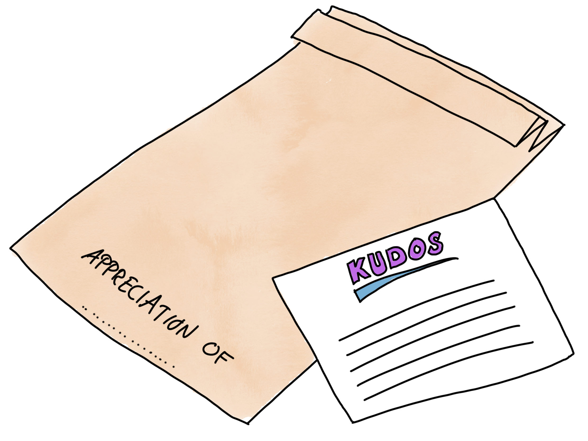

# Appreciation Cards

## Time required
&lt; 30 minutes for a typical team.

## Materials Required
*   One A4 paper per person.
*   One pen per person.

## Purpose
*   Enhance basic psychological safety in team by showing that team mates accept and appreciate each other as is.
*   Strengthen a sense of belonging in team.
*   Prepare for difficult conversations.

## How
1. Put the participants in a circle or similar formation. We need to be able to pass papers around in an ordered way.
2. Each person writes their name in the middle of the paper, folds it in the middle and passes it one step clockwise.
3. Tell everyone to just read the name on the paper they received and then write down what they appreciate most with this person. Wherever, in whatever direction you want. Max 2 min per note.
4. Pass the papers around until you get your own paper back.

Important, you should not read what others have written, just the name before you write your appreciations on a cards.

When you get your paper back you can do whatever you like with it, except telling someone else what is on it. The paper is only for the person receiving it.
