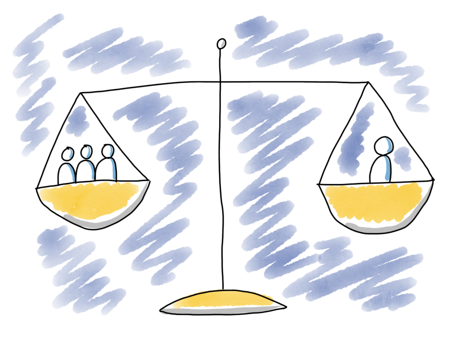

# Balancing Team- and Individual work

## Purpose
*   Create a shared view in team when it comes to advantages, disadvantages, and personal preferences when it comes to working closely as a team and when working individually.
*   Create some tools that will enable the team to get the benefits of and avoid the drawbacks of both ways of working.
*   Enable and inspire each team member to take responsibility for wellbeing of all other team members.

## Time required
35-50 minutes

## Materials Required
*   8 flip chart papers, board markers.
*   Tape.
*   Post-Its and some other small notes/papers.

## Preparations
*   Make sure a basic level of psychological safety exists in team before doing this.
*   Tape a big cross on the floor.
*   Put small notes/Post-Its at the ends of the tape: team/individual, +(positive)/-(negative)
*   Prepare your agenda so that the spirit in the room is good when we start. You may want to do an energizer? This fits nicely as a follow-up to "Journey Lines" or "Me Map".

## How
Explain that:

*   The goal of the exercise is to explore and to get to know our various experiences and thoughts around working individually and working as a team.
*   There is no right and wrong, just different experiences and thoughts.
*   The goal is not to get everyone to think that 100% close team collaboration is the one and only true solution.

**Intro/Warm up**

Explain the two axes: positive, negative, working as a team and working individually.
Invite the participants to walk around on the grid and try to recall some of their own experiences from the various quadrants. Give them 2 minutes in silence to do this. The purpose is to start recalling memories and to focus. When you give them these instructions - walk around in the grid (show by example is more effective than explaining)

**Exploration Pros and Cons**

In this section we will explore pros and cons of first individual work and then team work. We will start with positive - individual. People that appreciate individual work may feel more uncomfortable in an agile context. By doing it first we show and acknowledge the validity and importance of everyone's views/experiences.

*   On a flip chart write "Positive - Individual" as header.
*   Get everyone to stand in the positive - individual quadrant.
*   Ask one of the team members to take notes on the flip chart as all team members share their experiences of the positive aspects of working individually.
*   When done, save the flip chart paper somewhere visible. On the wall/floor or whatever works in the room you use.

Repeat this process in this order (new flip chart paper for each):

*   Negative - Individual work.
*   Positive - Team work.
*   Negative - Team work.

**Reflection, what way off working is best?**

Facilitate a quick reflection/discussion:

*   Is team work always the best approach for all types of work?

The conclusion could be along the lines of "We need to be smart and pick a way of working that will maximize the positive sides of both way of working."

Ask the team if they agree with this statement.

**Warning signals and actions**

"Let's think about how to achieve this in practice!" - On a new flip chart paper write "Individual work - warning signs". Ask the team - "How can we see if we are on our way into the negative aspects of individual work?"

Let a team member take notes as the team shares their ideas on this.

When some warning signals have been collected, switch to collecting actions.

“What actions would we take when we notice these signs - to get back into one of the positive quadrants"

Again, let a team member do the note taking as team members make suggestions.

Repeat for team-work

**Reflection, who is responsible?**

Ask the question

*   Who is responsible for us being in the positive?
Ideally this would be the responsibility of all team members.

**Current preferences**

"We are all humans, and we may have our preferences for how we want to work. This may change from week to week, day to day etc, depending on how many things such as life in general."

"Let’s end with exploring where you feel the most at home right now on the grid. If you have a preference: stand on the team individual axis to show what it is" (Do it yourself when explaining)

**Conclusions**

Ok, thank you all for sharing your experiences and creating all these nice posters!

Facilitate a wrap-up for the team. The purpose is to get buy in for any next steps and to celebrate and reinforce any insights or learnings. 

Ending on a positive note is also good!

Here are some possible questions you could ask them to discuss e.g., in pairs (pick one or two):

*   What was most interesting or valuable for you about this exercise/workshop?
*   What do you think our team can gain from looking for these warning signs/taking action?
*   What is needed for us to follow through on this and not having it fade away?
*   What else do we need to do to get the benefits we have been talking about?
*   How do you think paying attention to this can increase the well-being in our team?
