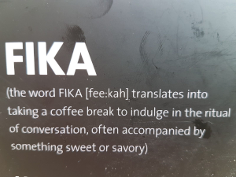

# Build trust with simple questions

## Purpose

Let a team learn more about each other when it comes to personal history. This will build trust within the team.

## Source

This exercise is described in the book “Five Dysfunctions of a Team” by Patrick Lencioni.

Lack of trust is the first dysfunction which you need to overcome in order to deal with the other four dysfunctions.

## Time required
*  30 minutes or more

## Preparations
*  None

## Facilitating
The idea is that if people start to reveal innocent details from their childhood, other people start to realize that they are real human beings, not just work robots.

In order to get this going you could be in a more relaxed place than the normal working area.

A perfect spot would be by the coffee machine or round a lunch table. Preferably together with some Swedish fika.

Let people answer these questions in pairs or in larger groups.
Note! Make sure people have the possibility to pass if they feel uncomfortable with any of the questions.

*  Where were you born?
*  How many siblings do you have?
*  Unique experience during your childhood?
*  What were you longing for during your childhood that you never got?
*  Favourite hobby?
*  What was your first job?
*  What is your most odd job?

See next chapter for some ideas on variations on this exercise

## Variations
*  Create a quiz with the answers to some of these questions. E.g., "Who was born in Norway". Hand the quiz out. Give the team the assignment to rotate and try to fill out the answers to the quiz by interviewing each other

*  If you are at an offsite, use the quiz approach just as above, but give them the day/weekend or whatever your timeframe is to complete it.

*  Arrange a speed-dating session with the purpose of learning as much as possible about each other. Propose the questions as topics for conversation. Perhaps do a
quiz after the session for fun.
