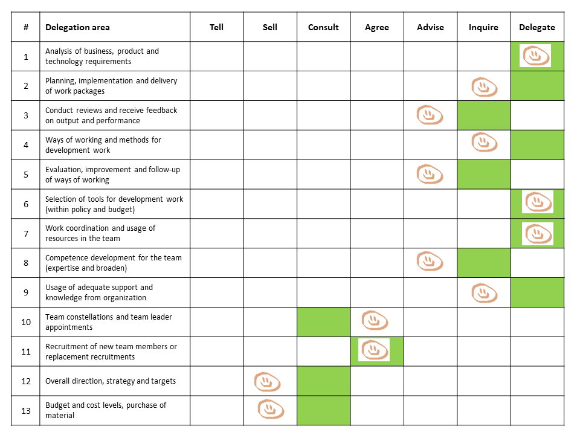

# Clarifying Team Mandates

## Purpose

* Encouraging more initiative and responsibility taking in a team
* Clarifying a team’s mandate when it comes to making decisions in various areas.
* Clarifying expectations on a team when it comes to taking responsibility for various areas.

## Time required

*   60 minutes

## Preparations
* [*Print*](https://management30.com/practice/delegation-poker/#download) or [*buy*](https://management30.com/shop/delegation-poker-cards/) some delegation cards, one set per session participant: team + manager(s) 
* Prepare a list of areas where you think clarification of mandate will be useful. The areas can be obtained from people responsible for things today, such as line managers, product managers, product owners etc. They can also be obtained from the team as areas where they would like to have (increased) influence or clarify responsibilities. 
In the example section below, you can see some suggestions on areas used in a real team setting.

## How

* Introduce the reason for/purpose of the session. Common examples:
	* “We want to move mandate to self-organizing autonomous teams to get faster better decisions”. If teams have had basic agile training, you can connect this to the central idea in agile transformations: decentralization to achieve organizational agility.
	* Make it clear how a team now is expected to take greater responsibility and that they have the mandate to do so
	* Also, clarify boundaries of team mandate so that teams do not misunderstand, unnecessarily overstep boundaries and "walk into invisible electric fences".

* Hand out a set of delegation cards to each participant. Introduce the cards: E.g. delegation is not black and white. Mandate can be moved to a team step by step while they get more used to/skilled at making various decisions.

* Walk through the areas you prepared one by one. For each step:
	* Have each participant pick the level of delegation that they would prefer for the area without showing the others
	* Show the cards to each other and have a discussion. If needed, facilitate decision making. [*5 finger voting*](https://proagileab.github.io/agile-team-development/guides/Ground-Rules-and-Decision-Making.html) can be a useful technique here. 
	* Document decision on mandate. In the next section you can see one example on how this was done. The green mark is the desire to delegate from the manager. The happy face is what the team agreed to/wanted.

## Example

This is the documentation after one session where a development manager wanted to clarify team mandates. The green mark is what the development manager wanted; the happy face is what the team wanted/agreed to.

Note that in all but one case, the team did not yet agree to take on the responsibility desired by the manager. In just one case the team did not get the level of mandate they wanted.

