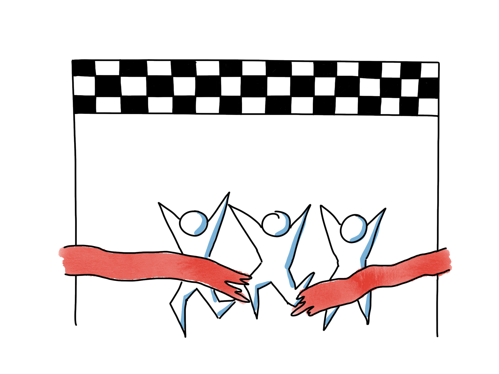

# Organizational Goals for Teams

Note, this guide have some shared parts with the Product Goals for Teams Guide. Similar passages have been marked with grey so that people familiar with that guide can see what differs.

## Time required
Typically 30 min - 1 hours, depending on how unfamiliar/unclear the vision and goals are to the team.

## Materials Required
  * Orange & green positits
  * Markers

## Purpose
   This is a teamstart/team development exercise. The purpose of it is for the team to get to know their purpose more in detail, for them to process it, discuss it, understand it and internalize it.

   Having a clear, compelling purpose is the most important factor when it comes to how a team performs. With no shared goal there will be no team.

   In the context where we work, we usually use self organizing teams.
 
   For a team we usually cover goals from several perspectives:
   *   **Line Organization &lt;- covered in this guide**
   *   Product
   *   Team
   *   Individual

## Preparations
Book some prep-sessions with a line manager responsible for the teams. They need to present the organizational/way of working vision/goals at the session. Expect at least 1+2 hours prep with some days in between to create attractive visions/a compelling direction from organization point of view.

The purpose of the line manager participating in this session is:
-  Explain reasons for agile improvement efforts/agile transformation in a way that energizes the team.
-  Explain what the team is expected to do as an agile team, except to develop product. This is usually:
  - Own their own ways of working and continuously improve it, i.e. they need to be experts on agile ways of working in addition to experts in programming/UX/test etc.
  - Work more closely and as a team instead of as individuals. Broaden skills, focus on team goals and help out in areas where you don't have super skills, but makes sense to meet the team goal.
  - Refine and improve skills in communication, decision making, problem solving and conflict management to be able to reach a truly well functioning self organizing team level.
  - Learn new skills in your area related to how to perform it with agile tools and techniques (i.e. test driven development, refactoring, Lean UX, Agile testing etc).
  - Take end to end responsibility including requirements, testing and deployment.
  - Synchronize directly with other teams rather than relying on other to do this.
  - ...

The vision regarding on why we are trying to get more agile and how we want the teams to develop needs to be high intensity, emotional, personal.

Some ideas on how to reach that in the prep session is below:
  - Avoid powerpoints. Human to human communication is most often best done without it.
  - A personal story is one of the most effective ways of communicating a vision. This comes from 100 000 years of human history telling around campfires before we invented more elaborate writing, so it is a uniquely tested and effective way to convey information and motivate/energize others.
  - Wording and expressions should be personal and use emotion. Words like proud, excited, sad etc are good to use. We do not want dry "professional" language.
  - Good stories around way of working may origin from examples. Ask the Line manager what are some examples where we work as best in this organization. Look for examples where we already work close as a cross functional team with a clear purpose, high authority to make decisions, close to the customer, short feedback cycles to deliver maximum value e.g.

  - Sometimes various “task forces” appears as an example. This is quite similar to what we want to achieve with agile teams, clear goals, all the right people, high authority to make decisions, no bureaucracy. But also point out that we want to do it with sustainable pace and high quality.
  - Maybe the vision can be summarized in a few keywords (max 3-5) and/or a small picture. Encourage live-drawing the vision/picture.
  - Thinking about the “receiver” is always good, what is in it for the team, for the individuals. Emphasize these aspects.

## How
  *As an agile team you are also a very important part of our agile transformation. The type of agile teams we are trying to grow and develop now probably also are quite different than teams you have been in the past. Maybe even even if they have been called "Scrum teams". So we have today out line manager to explain and discuss what it is that the organization wants to achieve in terms of way of working and how that affects your team.*

  *While talking you all will write some comments on orange and green positits. Green postits for clear goals directions that you hear. Orange for items you feel could be more clear or that you would like to discuss.*

  - Let the PO do the presentation. After, collect all clear/unclear postits on some flipcharts. Facilitate a summary of the green ones and a discussion/clarification of orange ones together with the line manager
  - Save the physical results for use in later retrospectives and other sessions
