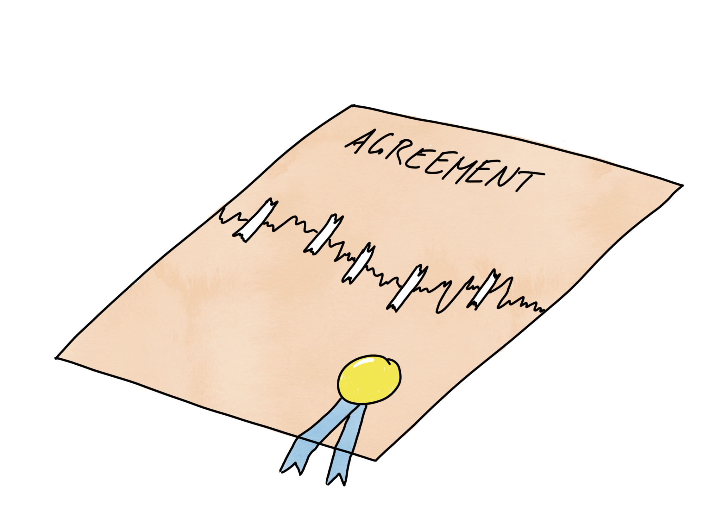

# Repairing Broken Agreements

## Time required:

30 min

## Purpose:

- Motivating teams to make agreements and to hold each other accountable for what has has been agreed
- After the sessions, the participants shall have the courage to bring up a broken agreement and the skills to repair it
- When teams practise this technique, it increases the basic emotional safety in the team which makes it a lot easier to develop as a team

## Preparations

-  Print Role studies from next sections for everyone. Each person should get either the "Chris" or "Sam" version.

-  Ask a co-trainer or someone in the session if they can demonstrate the technique with you as show a bit further below. Go through it with them, explain what you will bring up and why it would have seem like the correct thing to do from their point of view at the time.

## How

(The session below has been designed with the 4c learning approach from "Training from back of the room concept")

**Connect**: Did anyone experience that a team member did not really behave in a way that you think is ok in your team, but you did let it go because you though that bringing it up would be uncomfortable or lead to
conflict?

**Concept**

*To start with, if someone's behaviour is ok or not is a subjective matter. Someone might think it is perfectly ok to eat a dripping taco while they are borrowing your keyboard, and might not understand why you come running yelling for no reason....*

*Thus, when you are in a team, it is a good idea to have a conversation to try to set a few rules that the team agrees with. It can be about quality, how closely to work together, times, roles and meetings etc. Not too many are needed, 6-7 may be enough. This is an important part when building a team.*

If you are doing this as part of a team start session that includes also making working agreements, point out here that we will do that later, but this exercise is not about that part.

So, what should you do then if someone does not stick to what has been agreed? Who will bring it up? Actually one rule that needs to be in every teams working agreements is that when someone notices that another member don’t stick to the team agreements, that person needs to bring it up right away and repair the agreement. This is since when an agreement has been broken it does not really exist anymore and there is a big risk of "[*broken window
syndrome*](https://whatis.techtarget.com/definition/broken-window-theory)" kicking in.

*To prevent this from happening in your team each of you will now get to practise bringing something uncomfortable up with a colleague and repairing a broken agreement, but we will do it in a perfectly safe way using some made up cases that you will get to role play.*

*Here is the template that I want you to try out when you do this, it is from Christopher Avery who is a very skilled coach.*

**Example**

- *First show using an example, you may have prepared someone in the class to do this or do it with a co-facilitator. If you know the script the other person barely needs any preparation at all.*

   ***You***: *Sam, I had a look in the ocde and it seemed to me that you checked a lot of code in last night without any tests, was that so?*

   ***Sam***: *Yeah, that’s right. There was a crises and I had to etc etc*

   ***You***: *Ah. I see. It makes me a bit worried now that we get code without automatic tests into the system. Our team rule to not check anything in without tests have been really great for me. I have felt much more comfortable changing things and we do not get disturbed so much by trouble reports. I’m afraid if we start slipping ere with the testing we will soon be back where we started. What do you think about this rule of never to check in without tests?*

   ***Sam***: *I think it has been good. I was super stressed out yesterday and did not have time, that is all.*

   ***You***: *Do you think we need to change our rule to cover high stress situations better?*

   ***Sam***: *Nah, I think it is probably best if we keep it like it is. I will add the tests now and will take it a bit more easy the next time. Perhaps we could pair program more in those situations to help us not take shortcuts when we are stressed out.*

   ***You***: *Great! Let’s keep up our high quality! &lt;shake hands&gt;*

*What do you think? Can you bring something uncomfortable up in this way?*

**Template**

Show the participants the template below. Write it on a template and show that this is what you just demonstrated:

- Bring up what you noticed, check if the other person agrees with what you noticed?
- Tell the other person what the agreement means to you and why you want to keep it.
- Ask the other person about their view on the agreement
- Ask if the agreement needs to be changed to work for the other person
- Make a decision about a new agreement or decide to keep the old one.

**Concrete practise**

*Now each of you will get to practice this technique. I will give you a script with some made up cases and role studies. One of you will play Sam, one will play Chris.*

*In the first case Sam will bring up a broken agreement with Chris and in the second case Chis will bring something up with Sam.*

*Try to use the template that I showed you.*

Hand out the [*cases*](https://docs.google.com/document/d/1esGE5pbVGglY4YgakriqoMMRU3nP1r-RkjbpELQXmwk/),
(assign each person to be either Sam or Chris)

let them do it, ask some debriefing questions and encourage them,. That sounded great! Lots of conflict in the rool and everyone survived! How did that feel. What did you learn? 

*What will you take away from this exercise?*

**Conclusion**

*Make a note on how and when you could use this technique back at work. How could you introduce it to others?*

## Role study for person playing "Sam"

## Case 1: Sprint planning

### Background:

The rule in your team is that people should strive to participate in sprint planning sessions. You created this rule because you wanted the perspective of everyone during planning. Chris did not appear in the latest session and you had troubles getting to a good plan.

### Assignment:

*   Initiate a discussion with Chris about the broken agreement
*   Try to renegotiate it so that it fits you both.
*   Use Christopher Avery's technique for repairing broken agreements

## Case 2: Working from home

### Background:

Your company allows you to work from home. You usually take the opportunity to be able to focus.

## Role study for person playing "Chris"

## Case 1: Sprint planning

### Background:

Your dentist appointment was during the sprint planning so you could not participate. You already knew most of
what you would be working on so it was no big deal.

## Case 2: Working from home

### Background:

Your company allows working from home. Sam emails you for the third Friday in a row: "I will be working from home
today, I can be reached by mail and over communicator". You feel this is convenient for Sam personally but it is causing disadvantages for you as a team. Discussions need to take place remotely which is very slow compared to sitting together.

### Assignment:

*   Initiate a discussion with Sam about the situation
*   Try to create an agreement that meets both your needs

