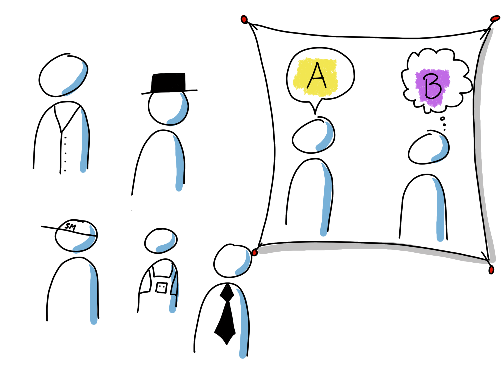
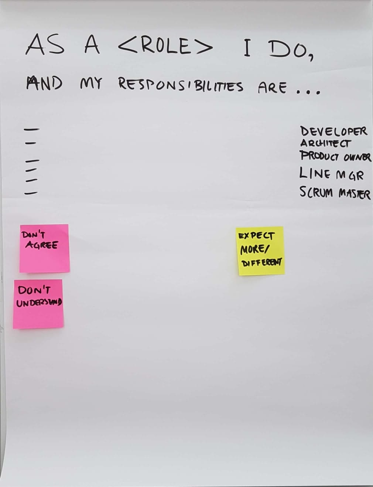
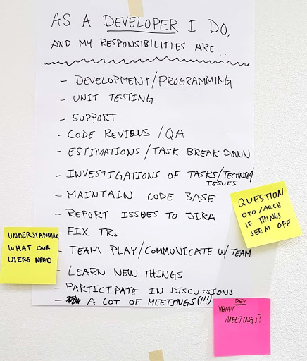

# Roles and Expectations

## Purpose
-  Clarify the different roles and expectations on the role (the one in the role and the others).

## Possible learning points
-  By clarifying the roles we understand our activities and responsibilities better and can work better together with fewer assumptions about who is doing what.

## Duration
-  30-60 min

## Material
-  One flipchart sheet or A3 paper for every participating role.
-  Postit notes (at least two different colors) and sharpies.

## How

-  Create a flipchart as a template with the sentence “As a <role> I do … and I am responsible for…”
   1.  Invite each role to create their own poster (flipchart or A3). If more than one person has the same role (e.g. developer) they should create one poster together. (10-15 min)
   2.  Invite each role to present the role. (1-3 min/role)
   3.  Invite the others to give feedback. They should have postit notes in two different colors. They write down the things they don’t agree to or don’t understand on one color of the postit notes. The other color is for things they lack in the role description. Put up the postit notes on the poster. No comments yet. Repeat this and the previous step for all roles. (1-3 min/role)
   4.  Invite each role to reflect on the feedback they have received and be prepared for a group discussion. (5 min)
   5.  Invite each role to respond to the feedback and have a group discussion about unclear and missing things. Repeat for all roles. (10-20 min)

