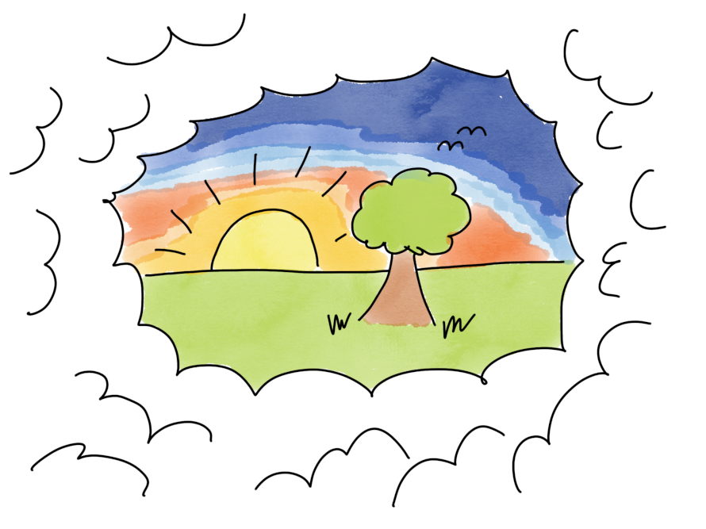

# Team Vision

## Time required

Typically 1 hour

## Materials Required

- Assorted positits
- Markers
- Coloured markers
- Flipchart papers
- Whiteboard, or even better a longer piece of paper/portable whiteboard plastic to put on the wall for the vision story
- Possibly some music playing device loaded with really soft instrumental music

## Purpose

This is a teamstart/team development exercise. The purpose of it is for the team to start defining themselves as a team by creating a shared team vision on what team they want this to be

For a team we usually cover goals from several perspectives:

- Organization
- Product
- **Team &lt;- Covered in this guide**
- Individual

## How

### Intro

*Now we have dealt with some of the goals from the organisation and product management.*

*The next few session will be about you and your team and what you want it to be. So, if we want this to be really  great team experience, maybe one of the best in your career so far, then probably we should should spend some time to get everyone's input on what that really great team experience would look like!*

*If you agree on what you are aiming at it increases the chance that you get there, does it make sense?*

### Warmup -&gt; pairwise

*Ok, as a warmup, I want you all first quietly think about a really great experience that you have had in a team. It could be at work or in a sports team etc, any team. Make a few notes on what happened and also start thinking about what made it so great. Next step will be to talk in pairs, but lets get started individually first for a few minutes. What was the best team you have been on, what made it so great?*

*Start a timer to avoid interrupting them before they even get started. Give them 4-5 minutes. If you want to avoid the silence, consider playing some really soft instrumental music.*

The reason why we want them to create their new team vision based on experience rather than on empty slogans is to anchor it more deeply by having it, again, be based on personal stories

Some people think better when they get some individual time first, having people write quietly is designed to make it easier for them. After 4-5 minutes, if everyone seems to have gotten started, interrupt them and then ask them to form pairs and share what they came to think of.

I have also done this jumping directly inte pairwise discussion and I think that worked nicely too, although in theory the quiet writing start is probably better.

### Subgroups -&gt; keywords

*After a few minutes of pairwise sharing, start collecting results, if the team is bigger than 6 persons, keep working with subgroups of 3-4 persons. Ask each subgroup to write down some keywords from their stories - if this was the best team you ever worked on - how would you describe it*

### Subgroups -&gt; visualizations

*Sometimes in the past we have asked teams to create a mission statement, like "we are brave and innovative and always work together with customer" - which may be a nice summary of what you have discussed, but perhaps a bit dry and not so inspiring, so today we will create two other representations of your team vision. To start with I would like each subgroup to illustrate with a small drawing using the coloured markers on a flipchart what you think the vision for your team should be. So, take 15 minutes to visualize what you came up with and then you will get to present it to the other subgroup.*

Hand out coloured markers and flipchart papers and start a timer

Make them present it to each other, facilitate som discussions about similarities and differences in the subgroups visualizations. Are there any areas that need decision making or can all team members consent to the team vision as visualised. Facilitate discussions and any decision making.

### Whole team -&gt; Vision story

*Ok, the idea with this is to help you discuss and agree on what a really great team would be for you, something that you can tell stories to your grandchildren about when you are sitting in your rocking-chair on your porch.*

*Which brings us to the final exercise for this topic. Now lets see if we can bring this great visionary drawings into our everyday work here. We will do it by creating something we call a "vision story". The purpose of a vision story is to make this even more hands on and easy to remember. The brain is actually uniquely good at remembering stories since this is how all human knowledge was probably passed on around campfires until we learned more advanced writing.*

*So the next step is to create a story that you can use later when when talk to each other and plan your work and when you notice that you deviate from your visions. Then you can always refer to your story. "Team...we are not doing it like we said!"*

*So, we will do this in two parts*

- *Pick something that you could work on as a team that would make it possible to include all or most parts from your visionary drawings. It could be a product goal or something you know is coming up in the backlog*
    
- *Create a story timeline here showing how you complete the work as a team, behaving exactly according to your amazing team vision! You can use text and small pictures, anyway you like!*

*In 15 minutes I would like to see and hear your story!*

Listen to their story, ask them if it covers the vision drawings? If not, can it be tweaked to include all? Then ask then are you going to to do this, in this way for real? Facilitate decision making.

When all is done, celebrate by a round of high fives or something! When you have done this task in this way you will never forget you ambitious team vision!
