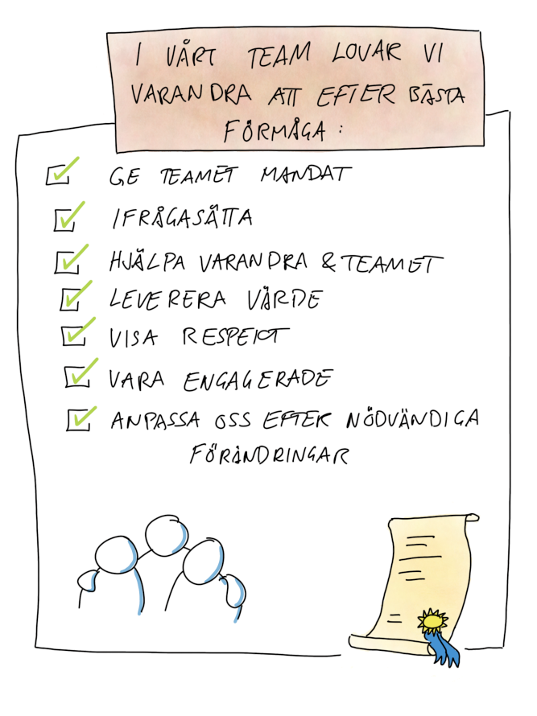

# Team Agreement

## Purpose
-  Set the stage for working as a team.

## Possible learning points
-  Clear rules of engagement within the team makes it easier to address and handle conflicts when they arrise.

## Duration
-  30-60 min

## Material
-  One flipchart sheet
-  PostIt notes and sharpies.
-  Note paper

## How
-  Each individual answers to the question "How would I like to be treated at work?" by writing short answers on PostIt notes (one item on each note)
-  Take turns to present one PostIt per person and put it up on the flipchart. If someone else has the same item, once the presenter has finished talking, they put their note on top of, or close by the presenter's PostIt. The individuals with the copies will then present another note with another topic.
-  As a group, try to group up similar topics by putting them close together, but not on top of each other.
-  In small groups (pairs) try to identify what values the different notes and groups of notes represent (a note with "I like it when people let me finish presenting my idea before they comment" might represent the value "Respect").
-  Each small group (or pair) presents the values they have identified for each group of notes (eliminate duplicates in the same way as above).
-  Use "fist to five" to identify which values all members of the team can buy in to.
-  Note down the values the team buys in to and use the information on the other PostIts to descibe how to live these values on the format "We value... by acting..." (for example: We Respect each other by listening and letting others finish before we comment)
